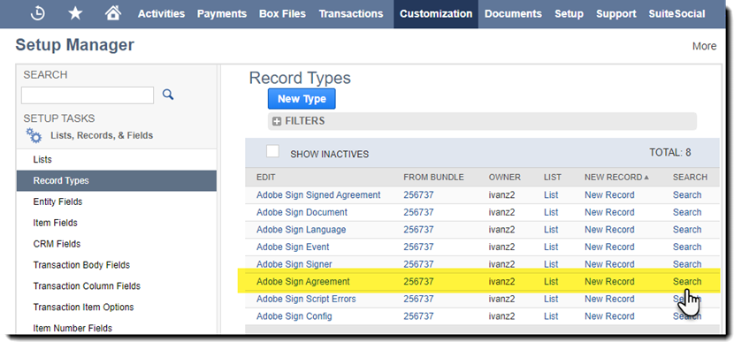
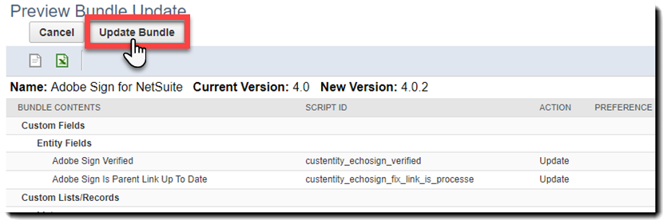
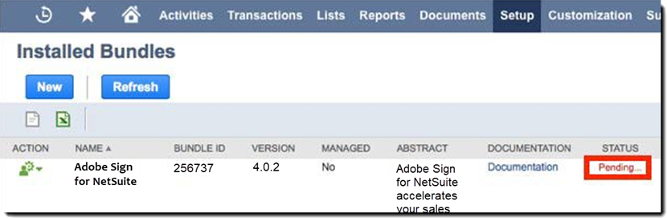
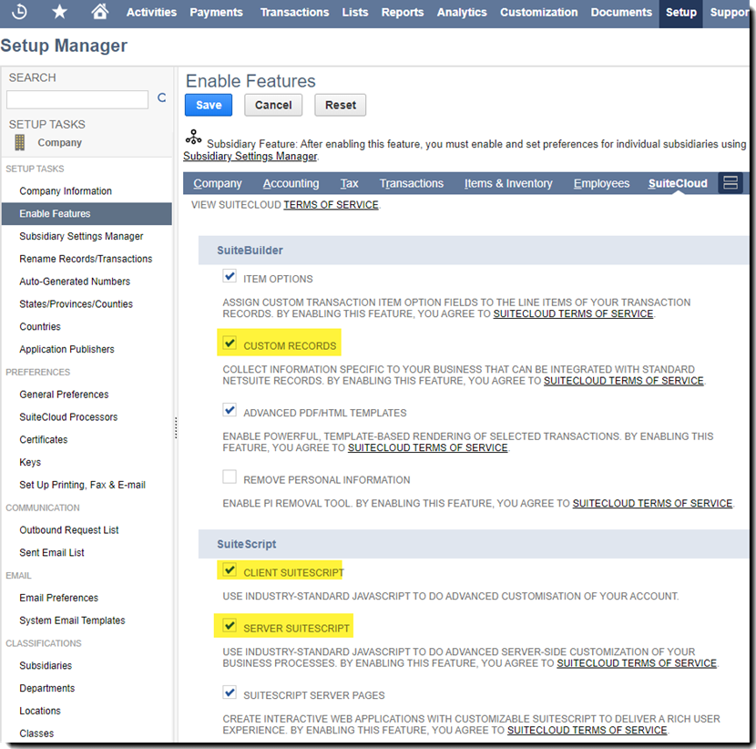
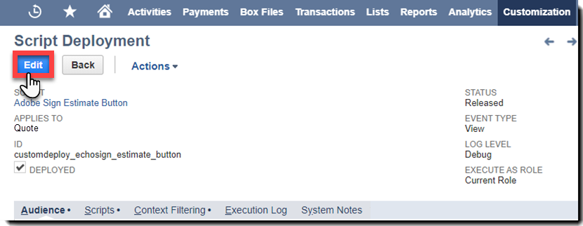
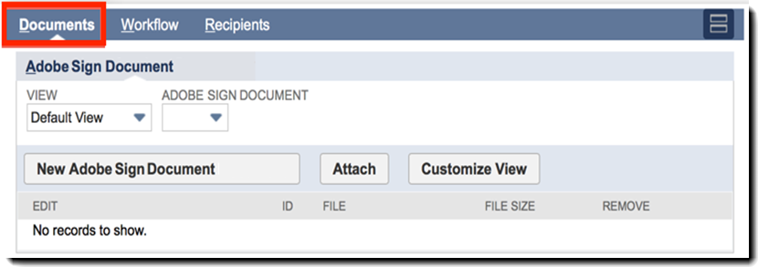
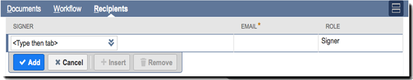

# NetSuite 설치 및 사용자 지정 가이드(v4.0.4){#install-customize-netsuite}

## 개요 {#overview}

Adobe Sign for NetSuite는 NetSuite와 완벽하게 통합되는 eSignature를 제공합니다. Netsuite 통합을 위해 Adobe Sign을 사용하면 NetSuite에서 수신자에게 직접 전자 서명이 필요한 계약, 견적 및 기타 문서와 같은 계약을 보낼 수 있습니다. 고객, 잠재 고객, 견적 및 기타 NetSuite 레코드로부터 Adobe Sign 계약을 작성하고 보낼 수 있습니다. Adobe Sign은 계약의 현재 상태로 NetSuite를 업데이트하고 계약이 완전히 실행된 후 관련 NetSuite 레코드와 계약을 저장합니다. 제품 내에서 NetSuite에서 보낸 모든 계약 내역을 볼 수 있습니다.

자세한 내용은 [Adobe Sign for NetSuite 릴리즈 노트](https://experienceleague.corp.adobe.com/docs/sign-integrations/using/netsuite/release-notes.html?lang=en)를 참조하십시오.

## 번들 설치 및 OAuth 구성 {#install}

NetSuite 관리자만 번들을 설치하거나 업데이트할 수 있습니다. OAuth를 구성하려면 NetSuite 관리자가 Adobe Sign에 대한 관리자 액세스 권한을 가져야 합니다. Production 계정에 번들을 설치하기 전에 NetSuite Sandbox 계정에서 번들을 설치하고 테스트해야 합니다.

테스트에 대한 자세한 내용은 [Adobe 서명 계약 만들기](#createagreement)를 참조하십시오.

>[!CAUTION]
>
>v4.0.4로 업그레이드하는 고객은 기존 API 키를 제거하지 않아야 합니다.
>
>API 키의 사용 방법에 대한 자세한 내용은 [사용자 지정 기본 설정 지정](#configure) 을 참조하십시오.

### 번들을 처음 설치합니다.

1. **사용자 지정 > SuiteBundler > Search &amp; Install Bundles**&#x200B;로 이동합니다.

1. *번들 검색 및 설치* 페이지에서 키워드로 **Adobe Sign**&#x200B;을 입력하고 **검색**&#x200B;을 선택합니다.

1. **Adobe Sign** 번들 이름을 선택합니다.

   

1. *번들 세부 정보* 페이지에서 **설치**&#x200B;를 선택합니다.
1. *번들 설치 미리 보기* 페이지에서 **번들 설치**&#x200B;를 선택합니다.

   (페이지의 기본값을 변경할 필요가 없습니다.)

   

1. 나타나는 설치 대화 상자에서 **확인**&#x200B;을 선택하여 계속합니다.

   설치 과정에서 번들의 상태가 *Pending*&#x200B;으로 표시됩니다.

   

1. 업데이트된 상태를 표시하려면 **새로 고침**&#x200B;을 선택합니다.

   번들 설치가 완료되면 *NetSuite*&#x200B;용 Adobe Sign이 *설치된 번들* 페이지에 표시됩니다.

   

1. 이미 Adobe Sign 고객 계정인 경우 [설치 또는 업그레이드 후 ](#oauth)OAuth 구성에 대한 단계를 따릅니다.

   Adobe Sign 계정이 없는 경우 [에서 엔터프라이즈 평가판](https://esign.adobe.com/adobe-sign-netsuite-trial-registration.html) 계정에 등록하여 시스템을 테스트할 수 있습니다. 온라인 등록 단계에 따라 Adobe Sign 계정을 활성화합니다.

## 설치 또는 업그레이드 후 OAuth 구성 {#oauth}

Adobe Sign에서는 OAuth 2.0을 사용하여 NetSuite 내에서 Adobe Sign 계정을 인증합니다.

이 프로토콜은 설치된 NetSuite 번들이 암호를 요청하지 않고 Adobe Sign과 통신할 수 있도록 권한을 부여합니다. 중요한 정보가 앱 간에 직접 공유되지 않으므로 계정이 손상될 가능성이 작습니다.

이 인증은 구현에 영향을 주지 않지만 프로덕션 또는 샌드박스 계정에 번들을 설치하거나 업그레이드한 후 일회성 구성을 수행해야 합니다.

OAuth를 구성하는 NetSuite 관리자는 Adobe Sign에 대한 계정 레벨 관리자 액세스 권한이 있어야 합니다.

1. NetSuite에서 *Adobe Sign Config* 목록 페이지로 이동합니다.

1. 헤더의 검색 필드를 사용하여 **Adobe Sign Config**(사용자 정의 레코드 유형)를 검색합니다.

1. 검색 결과 페이지에서 *Adobe Sign Config* 레코드에 대해 **View**&#x200B;를 선택합니다.

    검색

1. Adobe Sign Config List 페이지에서 **View** OAuth를 사용하여 Adobe Sign APIs *레코드에 액세스하려면*&#x200B;를 선택합니다.

   

1. Adobe Sign Config 페이지에서 **Adobe Sign으로 로그인**&#x200B;을 선택합니다.

   

1. 나타나는 Adobe Sign 로그인 페이지에서 자격 증명을 입력하고 **로그인**&#x200B;을 선택합니다.

   

1. 표시되는 액세스 확인 페이지(OAuth의 경우)에서 **액세스 허용**&#x200B;을 선택합니다.

   

1. 인증이 완료되면 아래와 같이 NetSuite의 Adobe Sign Config 페이지로 다시 리디렉션됩니다.

   

   >[!NOTE]
   >
   >Sandbox 계정에서 OAuth를 구성하는 경우 권한 부여가 완료되면 &quot;고객 compid를 확인할 수 없음&quot; 오류가 발생합니다.
   >
   >
   >계속하려면 다음과 같이 NetSuite 샌드박스를 가리키도록 브라우저에서 URL(system.netsuite.com)의 계정 도메인 부분을 변경해야 합니다.
   >
   >
   >변경:
   >
   >
   >system.netsuite.com/app/site/hosting/scriptlet.nl?script=745&amp;deploy=1&amp;web_access_point=https://echosign.com
   >
   >
   >받는 사람:
   >
   >
   >시스템을 사용합니다.**sandbox**netsuite.com/app/site/hosting/scriptlet.nl?script=745&amp;deploy=1&amp;web_access_point=https://echosign.com

## 번들 업데이트(기존 사용자)

NetSuite 번들 업데이트는 Adobe에서 정기적으로 제공됩니다. Adobe Sign for NetSuite 통합의 기존 사용자는 최신 번들로 업데이트할 수 있습니다.

>[!CAUTION]
>
>새 버전으로 업그레이드하는 고객은 기존 API 키를 제거하지 않아야 합니다.
>
>API 키의 사용 방법에 대한 자세한 내용은 [사용자 지정 기본 설정 지정](#configure) 을 참조하십시오.

### 사전 요구 사항 {#prerequisites}

v4.0.4 번들을 업데이트하는 데 필요한 시간은 현재 &#39;서명을 위해 종료&#39; 상태의 계약 수에 따라 다릅니다. 일반적으로 100개의 계약을 업데이트하는 데 7~10분이 걸립니다. 업데이트 시간을 추정하는 레코드 수를 기록해 둡니다.

서명을 위해 발송된 계약 수를 결정하려면

1. **사용자 정의 > 목록, 레코드 및 파일 > 레코드 종류**&#x200B;로 이동한 다음 *Adobe 서명 계약을 찾습니다.*

   또는 검색 표시줄에서 Adobe Sign Agreements를 검색합니다.

1. Adobe Sign Agreements 레코드의 경우 **검색**&#x200B;을 선택합니다.

   

1. **상태** 드롭다운에서 서명&#x200B;**에 대해**&#x200B;아웃을 선택한 다음 **전송**&#x200B;을 선택합니다.

   

   업데이트 시간을 추정하는 레코드 수를 기록해 둡니다.

   

### 번들 업데이트 {#updating-the-bundle}

1. **커스터마이제이션 > SuiteBundler > 검색 및 설치 > 목록**&#x200B;으로 이동하여 아래와 같이 현재 번들을 찾습니다.

   >[!NOTE]
   >
   >번들의 새 버전이 있으면 현재 번들의 *버전* 번호 오른쪽에 느낌표 아이콘이 표시됩니다.

1. 작업 드롭다운 메뉴에서 **업데이트**&#x200B;를 선택합니다.

   

1. 번들 업데이트 미리 보기 페이지에서 페이지에 표시된 기본값을 변경하지 않고 **번들 업데이트**&#x200B;를 선택합니다.

   설치하는 동안 번들 상태는 *보류 중*&#x200B;으로 표시됩니다.

   .

   >[!NOTE]
   >
   >번들을 업데이트할 때 아래와 같이 경고 메시지가 표시될 수 있습니다. NetSuite eSignature 레코드를 사용자 정의하지 않은 경우 계속할 수 있습니다. 확실하지 않은 경우 Sandbox 계정에 번들을 설치하여 프로덕션 계정에서 번들을 업데이트하기 전에 먼저 테스트하는 것이 좋습니다.
   

1. 업데이트된 상태를 표시하려면 **새로 고침**&#x200B;을 선택합니다.

   

   >[!NOTE]
   >
   >서명&#x200B;*계약에 대해 많은 수의*&#x200B;아웃(Out)이 있어 업데이트에 시간이 오래 걸리는 것으로 보이는 경우 *Adobe 서명 번들 설치* 스크립트의 **실행 로그** 하위 탭을 확인하여 업데이트 진행 상황을 확인할 수 있습니다. 자세한 내용은 [업데이트 진행 확인](#determineprogress)을 참조하십시오.

   번들 업데이트가 완료되면 *NetSuite*&#x200B;용 Adobe Sign이 *설치된 번들* 페이지에 표시됩니다.

   

## 번들 구성 {#configure}

### 사용자 지정 환경 설정 지정  {#set-custom-preferences}

사용자 정의 기본 설정을 사용하여 계약을 만들고 NetSuite에 저장하는 방법을 지정할 수 있습니다. 또한 Adobe Sign *의*&#x200B;자동 프로비저닝 사용자 기본 설정을 사용하면 NetSuite에서 계약을 보낼 때 NetSuite 사용자가 Sign 서비스에서 자동 프로비저닝되는지 여부를 지정할 수 있습니다.

1. **설정 > 회사 > 일반 환경설정**&#x200B;으로 이동합니다.
1. 페이지 아래로 스크롤한 다음 **사용자 지정 기본 설정** 하위 탭을 선택합니다.

   

1. 필요에 따라 Adobe Sign 환경 설정을 활성화하고 구성합니다.

   * **계정에 대한 EchoSign API 키를 입력하십시오**. 이 필드에 값을 추가하거나 편집하지 마십시오.
   * **상위 레코드 연락처를 서명자로 사용**: 활성화되면 계약이 작성될 때 상위 레코드 연락처는 기본적으로 첫 번째 서명자로 설정됩니다. 보낸 사람은 보내기 전에 기본 서명자를 쉽게 제거하거나 편집하거나 계약에 서명자를 추가할 수 있습니다.
   * **트랜스 사용**&#x200B;인 경우 서명자로 연락: 이 기본 설정은 *Use Parent Record Contact as Signer* 기본 설정도 사용하도록 설정된 경우에만 유효합니다. 거래 레코드에서 계약을 생성할 때(예: Quote) 기본 거래 담당자는 첫 번째 서명자로 기본 설정됩니다. 자세한 내용은 [트랜잭션 레코드](#transrecords)를 참조하십시오. 기본 트랜잭션 담당자가 없거나 NetSuite 객체 레코드(예: 고객 레코드, 파트너 레코드)에서 보낸 경우 기본 수신자는 고객 이메일의 기본 담당자가 됩니다. 보낸 사람은 보내기 전에 기본 서명자를 쉽게 제거하거나 편집하거나 계약에 서명자를 추가할 수 있습니다.
   * **수신자를 승인자로 표시 허용**: 사용하는 경우 보낸 사람은 받는 사람을 승인자로 표시할 수 있습니다. 승인자로 표시된 수신자는 계약을 검토 및 승인할 수 있지만 계약에 서명할 필요는 없습니다. 승인자는 승인 프로세스 중에 필드에 데이터를 입력해야 할 수 있습니다.
   * **기본 계약 폴더 ID**: 최종 서명된 계약이 저장될 폴더를 지정하는 데 사용됩니다. 이 필드에 값을 설정하지 않으면 최종 서명된 계약은 기본적으로 원본 문서 파일과 같은 폴더에 저장됩니다. 폴더 ID는 숫자여야 합니다.
   * **트랜잭션 PDF 자동 첨부**: 활성화되면 트랜잭션 레코드에서 새 계약이 생성될 때 트랜잭션 PDF가 계약에 자동으로 첨부됩니다.
   * **서명된 PDF 추가(첨부 파일 또는 링크)**: 드롭다운 ** 에서 Listis를 선택하면 서명된 PDF가 파일에 대한 링크로 자동으로 추가됩니다. *첨부 파일*&#x200B;을 드롭다운에서 선택한 경우 서명된 PDF는 계약 레코드의 첨부 파일로 NetSuite에 저장됩니다.
   * **계약과 함께 감사 추적 PDF 포함**: 활성화되면 계약이 서명된 후 감사 추적 PDF가 계약 레코드에 자동으로 첨부됩니다.
   * **ID 확인 방법 적용 대상**: ID 확인 방법을 활성화하는 것은 확인 방법이 적용되는 사용자에게 좌우됩니다. 옵션은 *모든 서명자, 외부 서명자만 *또는 *내부 서명자만*&#x200B;입니다.

   **ID 확인 방법** {#identity-verification-methods}

   사용 가능한 ID 확인 방법은 계약을 만들 때 선택할 수 있습니다. 여기에서 ID 확인 방법을 두 개 이상 사용하는 경우 Adobe 서명 계약 페이지에 **서명자 ID 확인** 옵션이 표시됩니다.

   * **서명에 필요한 암호 사용**: 서명자가 지정한 일회용 암호를 입력해야 합니다.

   * **지식 기반 인증 사용**: 서명자가 자신의 이름, 주소 및 선택적으로 SSN의 마지막 4자리 숫자를 입력한 다음 제공된 정보를 확인하는 질문 목록에 응답하도록 합니다. 미국에서만 사용할 수 있습니다.

   * **웹 ID 인증 사용**: 다음 사이트 중 하나에 로그인하여 서명자가 자신의 ID를 확인해야 합니다. Facebook, Google, LinkedIn, Microsoft Live, Twitter 또는 Yahoo!

   * **Adobe Sign에서 사용자 자동 프로비전**: 활성화되면 NetSuite에서 계약을 보내는 사용자는 Adobe Sign 사용자 계정으로 자동으로 프로비저닝됩니다.

1. **저장**&#x200B;을 선택하여 기본 설정을 저장합니다.

## 자동 상태 업데이트 구성 {#asu}

Adobe Sign 통합 번들을 사용하면 NetSuite에서 보낸 계약 상태에 대한 업데이트를 NetSuite에서 자동으로 받을 수 있습니다. 이 기능이 활성화되면 NetSuite는 항상 계약의 현재 상태를 반영합니다. 다음과 같이 자동 상태 업데이트를 활성화할 수 있습니다.

1. **설정 > 회사 > 기능 사용으로 이동합니다.**
1. **SuiteCloud** 하위 탭을 선택합니다.
1. 다음 옵션을 활성화합니다.

   * SuiteBuilder 섹션에서 **사용자 지정 레코드** 옵션을 활성화합니다.

   * SuiteScript 섹션에서 **Client SuiteScript** 및 **Server SuiteScript** 옵션을 활성화하고 두 가지 서비스 약관에 동의합니다.

1. **Save**&#x200B;를 선택합니다.

   옵션은 이미지에 표시된 대로 설정됩니다.

   

## 개체 및 레코드 종류 {#objects}

Adobe Sign 통합 번들은 이미 다음과 같은 많은 표준 NetSuite 객체와 함께 Adobe Sign Agreement 객체를 노출합니다. 고객, 견적, 가망 고객, 기회 및 파트너 기록 사용자 지정 레코드를 비롯하여 다른 레코드 종류와 함께 Adobe Sign 번들을 사용할 수도 있습니다.

계약 탭은 다음 두 가지 유형의 NetSuite 레코드와 함께 표시될 수 있습니다. 엔티티 및 트랜잭션 레코드 일반적으로 트랜잭션 레코드는 PDF 문서로 변환할 수 있는 레코드(예: 견적)인 것으로 가정합니다. 반면 엔터티 레코드는 PDF로 변환할 수 없습니다.

## 트랜잭션 레코드 {#transrecords}

계약이 트랜잭션 레코드에서 작성된 경우 계약 레코드의 첫 번째 문서는 해당 레코드의 PDF 버전이고 첫 번째 수신자는 레코드의 전자 메일 주소입니다. 첫 번째 문서를 PDF 버전의 레코드로 만들지 않으려면 **설정 > 회사 > 일반 기본 설정 > 사용자 정의 기본 설정 하위 탭**&#x200B;으로 이동하여 **트랜잭션 PDF** 자동 첨부 옵션을 비활성화합니다. 자세한 내용은 [사용자 지정 기본 설정 지정](#configure) 을 참조하십시오.

사용자 정의 기본 설정에서 **Use Trans를 활성화할 수도 있습니다. 기본 트랜잭션 연락처를 첫 번째 서명자로 자동으로 추가하려면 첫 번째 서명자로 연락합니다**. 트랜잭션 레코드와 연결된 경우 **Agreements** 및 **Send for Signature** 단추가 표시됩니다.

## 엔터티 레코드 {#entity-records}

엔터티 레코드에서 계약이 작성되면 첫 번째 받는 사람이 레코드의 전자 메일 주소입니다. 엔티티 레코드와 연관된 경우 계약 탭만 표시됩니다.

## 번들 사용자정의 {#customize}

번들을 사용자 정의하는 작업에는 다음이 포함됩니다.

* 계약 하위 탭에 대한 스크립트 배포 및 해당 레코드 유형에 대한 서명을 위해 보내기 단추
* Adobe Sign 레코드 종류에 대한 역할 권한을 설정합니다.
* *Agreements* 하위 탭에 대한 액세스 권한을 부여하는 권한과 *Send for Signature* 단추를 수정하는 중입니다.

### 추가 레코드 종류에 대한 Adobe 서명 계약 구성  {#configuring-adobe-sign-agreements-for-additional-record-types}

적절한 레코드 종류에 대해 *계약* 하위 탭과 *서명을 위해 보내기* 단추를 배포하려면 다음과 같이 하십시오.

1. **사용자 지정 > 스크립팅 > 스크립트로 이동합니다.**

1. 나타나는 *스크립트* 목록 페이지에서 배포할 스크립트를 찾은 다음 **보기**&#x200B;를 선택합니다.

   * *서명을 위해 보내기* 단추를 추가하려면 **Adobe Sign Estimate Button** 스크립트를 선택합니다.

   * *계약* 탭을 추가하려면 **Adobe 서명 계약 로더** 스크립트를 선택합니다.

1. 스크립트 페이지에서 **스크립트 배포**&#x200B;를 선택합니다.

   

1. [스크립트 배포] 페이지에서 다음을 수행합니다.

   * *적용 대상* 목록에서 레코드 유형을 선택합니다.
   * 필요에 따라 스크립트 배포 ID를 입력합니다.

      자세한 내용은 NetSuite 도움말 센터의 *사용자 지정 스크립트 배포 ID* 항목을 참조하십시오. ID를 입력하지 않으면 ID가 생성됩니다.

   * **배포된** 확인란을 선택합니다.

   

   * *상태*&#x200B;를 **릴리즈됨**&#x200B;으로 설정합니다.

      *이벤트 유형* 또는 *로그 레벨*&#x200B;을 지정할 필요는 없습니다.

   * *역할로 실행* 드롭다운에서 **실행을 Admin**&#x200B;으로 선택합니다.

   * **Audience** 하위 탭이 활성화되어 있는 상태에서(기본적으로 활성) 액세스 권한을 부여할 특정 역할이나 사용자를 선택합니다. 모든 역할 및 사용자에게 액세스 권한을 부여하려면 각 **모두** 옵션을 선택합니다.

   * **Save**&#x200B;를 선택합니다. 변경 확인이 표시되면 **뒤로 이동**&#x200B;을 선택합니다.

1. 스크립트 배포 페이지 상단에서 **목록**&#x200B;을 선택하여 *스크립트* 목록 페이지로 돌아갑니다.
1. 다른 스크립트에 대해 위의 2단계와 3단계를 반복합니다.

## Adobe Sign 레코드 종류에 대한 역할 권한 설정  {#setting-role-permissions-for-adobe-sign-record-types}

대부분의 NetSuite 역할에는 추가 사용자 지정 없이 Adobe Sign을 사용할 수 있는 권한이 있어야 합니다. 그러나 만들어진 추가 사용자 정의 역할에 대한 권한을 부여해야 할 수도 있습니다.

1. **사용자 지정 > 목록, 레코드 및 파일 > 레코드 종류**&#x200B;로 이동합니다.

   

   >[!NOTE]
   >
   >*레코드 종류* 항목이 표시되지 않으면 **설정 > 회사 > 기능 활성화 > Suite 클라우드 탭**&#x200B;으로 이동하여 *사용자 지정 레코드* 옵션을 활성화합니다.

1. *레코드 종류* 페이지에서 **Adobe Sign Agreement**&#x200B;를 선택하여 선택합니다

   

1. *사용자 지정 레코드 종류* 페이지의 *액세스 유형* 드롭다운에서 **사용 권한 목록**&#x200B;을 선택합니다.

   

   >[!NOTE]
   >
   >*Adobe Sign Agreement* 레코드 유형은 *사용 권한 목록* 액세스 유형이 필요한 유일한 Adobe Sign 레코드 유형입니다.
   >
   >
   >다른 Adobe Sign 레코드 종류의 액세스 유형 설정에 대한 지침은 6단계를 참조하십시오.

1. **사용 권한** 하위 탭을 선택합니다.

   역할 및 권한 목록이 표시됩니다.

   

1. &quot;Adobe Sign Agreement&quot; 레코드 유형에 추가된 추가 사용자 정의 역할에 대한 사용 권한을 다음과 같이 설정합니다.

   >[!NOTE]
   >
   >자세한 내용은 NetSuite 도움말 센터의 *[사용자 지정 레코드 종류](https://system.netsuite.com/app/help/helpcenter.nl?fid=section_N2879931.html)*&#x200B;에 대한 사용 권한 목록 설정 항목을 참조하십시오.

   1. *역할* 목록에서 역할을 선택합니다.
   1. *수준*&#x200B;을 **전체**&#x200B;로 설정
   1. *기본 양식*&#x200B;을 **사용자 지정 EchoSign 계약 양식**&#x200B;으로 설정
   1. *양식 제한 확인란 선택*
   1. **추가**&#x200B;를 선택하여 역할 행의 변경 내용을 저장합니다.

   

   새 행은 다음과 같이 표시됩니다.

   

   모든 추가 사용자 정의 역할에 대해 위의 단계 a - e를 반복합니다.

   * 모든 역할에 대한 사용 권한이 설정된 경우 *사용자 지정 레코드 종류* 페이지에서 **저장**&#x200B;을 선택합니다.

   *고객 레코드 종류* 페이지가 다시 표시됩니다.

1. 위의 1-3단계를 반복하여 다른 모든 Adobe Sign 레코드 종류에 대한 *액세스 유형*&#x200B;을

   **권한이 필요하지 않습니다.** 다음 레코드 유형에 적용됩니다.

   * Adobe 서명 구성
   * Adobe Sign 문서
   * Adobe 서명 이벤트
   * Adobe 사인 언어
   * Adobe 서명 스크립트 오류
   * Adobe 서명 계약
   * Adobe 서명 서명자

### 계약 탭에 대한 액세스 권한 부여 및 서명을 위해 보내기 단추  {#granting-access-to-the-agreement-tab-and-send-for-signature-button}

Adobe Sign 통합 번들은 이미 많은 표준 NetSuite 객체(Customer, Estimate [Quote], Lead 등)와 함께 Adobe Sign Agreement 객체를 노출합니다. *계약* 하위 탭은 다음 유형의 객체에 대해 자동으로 활성화됩니다. 고객, 잠재 고객, 영업 기회, 파트너, 잠재 고객, 견적 및 공급업체 청구

*Send for Signature* 단추는 Quote 개체&#x200B;**에 대해서만 자동으로 활성화됩니다.**

NetSuite 관리자는 권한을 수정하여 *계약* 하위 탭, *서명을 위해 보내기* 단추 또는 둘 모두를 해당 개체에 추가함으로써 계약을 추가 CRM 개체로 만들 수 있는 기능을 확장할 수 있습니다.

#### 서명을 위해 보내기 단추에 대한 액세스 권한을 부여하는 권한 수정  {#modifying-permissions-to-grant-access-to-the-send-for-signature-button}

1. **사용자 지정 > 스크립팅 > 스크립트**&#x200B;로 이동합니다.

   *스크립트* 목록 페이지가 표시됩니다.

   * 필요한 경우 필터를 사용하여 Adobe 서명 스크립트를 찾습니다

1. *스크립트* 페이지에서 *Adobe Sign Estimate Button* 스크립트(Send for Signature *단추 제어)를 찾은 다음&#x200B;**보기**을 선택합니다.*

   

1. *스크립트* 페이지에서 다음을 수행합니다.

   * **배포** 하위 탭을 선택합니다.

   * &quot;*Applies to*&#x200B;에서 수정할 엔터티의 링크를 선택합니다

      * **이** 예의 Quotein

   

   * *스크립트 배포* 페이지에서 **편집** 단추를 선택합니다.

   

   * **Audience** 하위 탭이 활성화된 상태에서 액세스 권한을 부여할 특정 역할이나 사용자를 선택합니다.

      * 모든 역할 및 사용자에게 액세스 권한을 부여하려면 해당 **모두**&#x200B;옵션 선택
   * **저장**&#x200B;을 선택합니다.

   

#### 계약 탭에 대한 액세스 권한을 부여하는 권한 수정  {#modifying-permissions-to-grant-access-to-the-agreements-tab}

1. **사용자 지정 > 스크립팅 > 스크립트**&#x200B;로 이동합니다.
1. *스크립트* 페이지에서 *Adobe 서명 계약 로더* 스크립트를 찾습니다(*계약 탭* 제어).

   * **보기**&#x200B;를 선택합니다.

1. *스크립트* 페이지에서 다음을 수행합니다.

   1. **배포** 하위 탭을 선택합니다.
   1. &quot;*Applies to*&#x200B;에서 액세스를 수정할 엔터티의 링크를 선택합니다
   1. *스크립트 배포 *페이지에서 **편집** 단추를 선택합니다

   1. **Audience** 하위 탭이 활성화되어 있는 상태에서(기본적으로 활성화되어 있음) 액세스 권한을 부여할 특정 역할이나 사용자를 선택합니다. 모든 역할 및 사용자에게 액세스 권한을 부여하려면 각 **모두** 옵션을 선택합니다.

   1. **저장**&#x200B;을 선택합니다.

## NetSuite 번들에 Adobe Sign 사용

NetSuite에서 계약을 보내고 해당 계약에 대한 업데이트를 받으려면 NetSuite와 Adobe Sign에서 동일한 로그인 ID(전자 메일 주소)를 가져야 합니다.

### Adobe 서명 계약 만들기

Sandbox 또는 Production 계정에 새 번들을 설치한 후 새 계약을 만들어 번들을 테스트해야 합니다. 엔티티 레코드, 트랜잭션 레코드 또는 독립형 계약으로 Adobe 서명 계약을 만들 수 있습니다.

>[!NOTE]
>
>계약을 만드는 프로세스는 계약을 만드는 방법에 따라 약간 다릅니다. 일반 프로세스에는 계약에 대한 옵션을 지정하고 계약 문서를 하나 이상 추가하고 수신자를 지정하는 작업이 포함됩니다. 아래에 설명된 프로세스에서는 고객 레코드에서 계약을 작성하는 것으로 가정합니다.

1. 계약을 보낼 고객 레코드를 선택하거나 만들거나 계약 탭이 활성화된 다른 NetSuite 레코드 종류를 선택할 수 있습니다.

1. 레코드에서 **계약** 하위 탭을 선택합니다.
1. **새 계약**&#x200B;을 선택합니다.

   

1. *Adobe 서명 계약* 페이지에서 **편집**&#x200B;을 선택합니다.

   

1. 계약에 대한 옵션을 다음과 같이 지정합니다.

   * **계약 이름** — 계약의 이름을 입력합니다.
   * **Message**-받는 사람의 사용자 지정 메시지를 입력합니다.
   * **서명 유형** — 문서에 허용된 서명 유형을 선택합니다. 옵션은 *e-Signature* 및 *팩스 서명*&#x200B;입니다.

   * **또한 이 계약에 서명해야 함** — 보낸 사람이 계약에 서명해야 함을 나타내려면 이 옵션을 활성화합니다.
   * **서명 순서**-이  *계약* 에 서명해야 함 옵션이 활성화된 경우 보낸 사람과 받는 사람이 서명해야 하는 순서를 선택합니다. 옵션은 &quot;I sign, recipients sign&quot;, &quot;Recipients sign, I sign&quot; 및 &quot;None&quot;입니다.

   * **문서 또는 직책 서명 미리 보기(또는 양식 필드)** — 보낸 사람이 계약을 미리 보고 받는 사람에게 보내기 전에 계약에 필드(서명 끌어서 놓기, 초기 필드 및 기타 양식 필드)를 추가할 수 있도록 하려면 이 옵션을 사용합니다.
   * **서명자 ID 확인** — 이 옵션을 활성화한 다음 다음 ID 확인 옵션 중 하나를 선택합니다

      * 이 옵션은 아래에 나열된 세 가지 서명자 ID 확인 방법 중 두 가지 이상이 사용자 지정 기본 설정에서 활성화된 경우에만 표시됩니다. 자세한 내용은 [사용자 지정 기본 설정 지정](#customize) 을 참조하십시오. 하나의 기본 설정만 사용하도록 설정된 경우 **서명자 ID 확인** 옵션이 표시되지 않습니다.

   **ID 확인 방법**

   * **서명에 필요한 암호** — 서명자가 지정한 일회용 암호를 입력해야 합니다.
   * **지식 기반 인증** — 서명자가 자신의 이름, 주소 및 SSN의 마지막 4자리 숫자를 제공해야 하며, 그런 다음 제공된 정보를 확인하는 질문 목록에 답해야 합니다. 미국에서만 사용할 수 있습니다.
   * **웹 ID 인증** — 다음 사이트 중 하나에 로그인하여 서명자가 ID를 확인해야 합니다. Facebook, Google, LinkedIn, Twitter, Yahoo! 또는 Microsoft Live.
   * **암호 PDF**  보기 필요— 계약이나 서명된 계약의 PDF를 열기 전에 수신자가 암호를 입력해야 하는 경우 이 옵션을 사용합니다. 모든 사람에게 전송되는 PDF 파일은 암호화되며 이 암호를 사용하여 파일을 열어야 합니다. 복구할 수 없으므로 암호를 잃지 마십시오. 암호를 잃은 경우 해당 트랜잭션을 삭제하고 다시 시작해야 합니다.
   * **암호/암호 확인** —  *PDF 보기에 필요한 암호 옵션이* 활성화된 경우 계약을 보는 데 사용할 암호를 입력합니다.
   * **받는 사람에게 서명하도록**  알림— 받는 사람에게 미리 알림을 보낼 수 있는지 및 간격을 지정합니다. 옵션은 *Never*, *Daily* 또는 *Weekly*&#x200B;입니다.
   * **언어:받는 사람에게 서명 페이지 및 전자 메일 알림을 표시할 언어를** 지정합니다.
   * **첫 번째 서명자에 대한 호스트 서명** — 보낸 사람 호스트가 첫 번째 서명자에 대한 직접 서명을 허용하려면 이 옵션을 사용합니다.
   * **서명 마감**  일까지 일수— 계약에 대한 서명 마감일을 나타내는 정수를 입력합니다(오늘 날짜 + 일 수).
   * **상위 레코드** — 상위 레코드를 선택하여 계약에 연결합니다(선택적).

   

1. **Documents** 탭을 선택합니다.

   

1. *Documents* 하위 탭에서 *Adobe Sign Document* 드롭다운을 사용하여 파일 캐비닛의 기존 문서를 첨부한 다음 **Attach**&#x200B;를 선택합니다.

   또는 **새 Adobe Sign Document**&#x200B;를 클릭하여 *Adobe Sign Document* 페이지에 액세스한 다음 NetSuite 파일 캐비닛에 문서 이름을 입력하거나 트랜잭션 레코드에서 파일을 선택하거나(해당하는 경우) 새 문서를 첨부합니다.

   계약에 여러 문서를 추가할 수 있습니다.

1. **받는 사람** 하위 탭을 선택하고 연락처 목록에서 선택하거나 전자 메일 주소를 입력하여 받는 사람을 지정합니다.

   

   받는 사람 각각을 서명자 또는 참조로 표시할 수 있습니다. *수신자를 승인자 서명자* 사용자 정의 기본 설정으로 표시 허용을 사용하는 경우 수신자를 승인자로 표시할 수도 있습니다. 자세한 내용은 [사용자 지정 기본 설정 지정](#customize) 을 참조하십시오.

   * **서명자** 는 계약서에 서명해야 합니다.
   * **동의서는 승인하되 계약에 서명하지 않아야 하며 선택적으로 계약에 데이터를 추가해야 할 수도 있습니다.** 
   * **CC&#39;d** Recipientsagreement 업데이트에 대한 알림과 계약이 서명되고 완료되면 CC 수신자는 서명 또는 승인 프로세스의 당사자가 아닙니다.

      *상위 레코드 연락처를 서명자* 사용자 지정 기본 설정으로 사용하거나 *Use Trans와 함께 사용할 경우 서명자* 기본 설정으로 연락하면 첫 번째 수신자가 기본값으로 설정되지만 변경할 수 있습니다.

1. 각 수신자를 입력한 후 **추가**&#x200B;를 선택합니다.

1. 계약을 저장하려면 **Save**&#x200B;를 선택합니다.

### 서명에 대한 계약 보내기

계약을 보낼 준비가 되면 **서명을 위해 보내기** 단추를 선택합니다.

* *문서 미리 보기 또는 직책 서명* 옵션을 사용하는 경우 **서명을 위해 보내기**&#x200B;를 클릭합니다. 열려 있는 창에서 문서를 미리 보거나 양식 필드를 문서로 끌어 놓은 다음 문서를 보냅니다. **Send**&#x200B;를 선택하여 계약을 받는 사람에게 보냅니다.

* *첫 번째 서명자를 위한 호스트 서명* 옵션을 사용하는 경우 **서명을 위해 보내기**&#x200B;를 클릭합니다. 열리는 창에서 서명자가 보낸 사람과 함께 문서에 서명할 수 있습니다.

   *현재 서명자를 위한 호스트 서명* 링크는 문서가 서명될 때까지 액세스할 수 있는 *첫 번째 서명자를 위한 호스트 서명* 필드 옆에도 나타납니다. 이 링크를 사용하여 여러 서명자에 대한 계약 서명을 호스팅하거나 실수로 닫은 경우 팝업 창을 다시 엽니다.

계약서가 발송되면 수신자는 서명을 기다리는 서류를 알려주는 이메일을 받게 된다.

받는 사람이 문서에 서명하면 보낸 사람은 전자 메일로 문서가 서명되었다는 알림을 받습니다.

#### 견적에서 보내기

Adobe Sign은 NetSuite의 Quote와 직접 통합되어 견적의 PDF가 자동으로 생성되어 계약 레코드에 첨부됩니다.

Quote 를 볼 때 **Send for Signature**&#x200B;를 선택합니다. 계약에 첨부된 견적을 생성하고 표시합니다. *서명을 위해 보내기* 단추를 다른 트랜잭션 레코드 종류에 추가할 수도 있습니다. 자세한 내용은 [개체 및 레코드 종류](#objects)를 참조하십시오.

### 상태 추적 및 미리 알림 보내기

계약서를 보낸 후:

* 문서 상태가 계약 세부 정보 섹션의 서명&#x200B;*에 대해*&#x200B;아웃으로 변경됩니다.
* *서명을 위해 보내기* 단추가 다음 세 개의 단추로 바뀝니다.

   * **업데이트 상태** — 상태 업데이트가 구성되지 않은 경우 상태를 수동으로 업데이트하려면 이 단추를 선택합니다. 자세한 내용은 [자동 상태 업데이트 구성](#asu)을 참조하십시오.
   * **미리 알림**  보내기— 현재 서명자에게 미리 알림을 보내려면 이 단추를 선택합니다.
   * **계약 취소** — 계약을 취소하려면 이 단추를 선택합니다. 모든 수신자가 아직 서명을 하지 않은 경우 서명을 위해 계약을 보낸 후 계약이 취소될 수 있습니다.

새 *Events* 하위 탭이 계약 상태를 추적할 수 있는 계약 레코드에 표시됩니다.

계약 이벤트의 기록을 볼 수 있습니다. 여기에는 계약이 발송, 조회 및 서명된 시기에 대한 정보가 포함됩니다.

계약이 서명된 후:

* 상태가 *Signed*&#x200B;로 변경됩니다.
* 링크를 사용하여 이 계약의 상위 레코드에 다시 연결할 수 있습니다.
* 서명된 문서 및 감사 추적 아래의 &quot;다운로드&quot; 링크를 사용하여 이러한 문서에 액세스할 수 있습니다.
* 서명된 문서의 축소판을 볼 수 있도록 *서명된 문서* 하위 탭이 추가로 표시됩니다.

>[!NOTE]
>
>서명을 위해 계약을 보낸 후에는 레코드를 편집할 수 없습니다. 이벤트 기록을 보존하기 위한 것입니다.

## 번들 제거

번들을 제거하려면 NetSuite 도움말에 설명된 단계를 따릅니다. 자세한 내용은 NetSuite 도움말 센터의 *[번들 제거](https://docs.oracle.com/cloud/latest/netsuitecs_gs/NSBDL/NSBDL.pdf)* 항목을 참조하십시오.

번들을 제거하면 서명되지 않은 계약이 삭제됩니다. 서명된 계약 및 해당 감사 PDF 파일은 영향을 받지 않습니다.

서명되지 않은 계약을 유지해야 하는 경우 번들을 제거하지 마십시오.

## 문제 해결

### 업데이트 진행률 확인

업데이트가 더 오래 걸리는 것으로 나타나면 Adobe Sign Bundle 설치 스크립트의 실행 로그 하위 탭을 확인하여 다음과 같이 업데이트 진행률을 결정할 수 있습니다.

1. **사용자 지정 > 스크립팅 > 스크립트**&#x200B;로 이동합니다.
1. *스크립트* 페이지에서 *Adobe Sign Bundle Installation* 스크립트를 찾은 다음 **편집**&#x200B;을 선택합니다.
1. *스크립트* 페이지에서 **실행 로그** 하위 탭을 선택합니다.
1. **새로 고침**&#x200B;을 선택합니다.

   실행 로그가 업데이트되어 현재 상태가 반영됩니다. *Details* 열에는 계약 업데이트 진행 상황이 표시됩니다.

   

### 액세스 토큰 문제 해결

계약과 상호 작용할 때 &quot;제공된 액세스 토큰이 잘못되었거나 만료되었습니다.&quot; 메시지가 나타날 수 있습니다.

이 문제는 다음과 같은 이유로 발생할 수 있습니다.

* OAuth를 구성한 NetSuite/Adobe Sign 관리자가 액세스 토큰을 해지했습니다.
* 지난 60일 동안 NetSuite에서 계약을 보내지 않았기 때문에 액세스 토큰이 만료되었습니다.
* NetSuite/Adobe Sign 관리자가 초기 OAuth 구성을 완료하지 못했습니다.

이 문제를 해결하려면 OAuth 구성 프로세스를 다시 실행하십시오. 자세한 내용은 [설치 또는 업그레이드 후 OAuth 구성을 참조하십시오.](#oauth)

### 문서 상태 문제 해결 {#resolvestatus}

[자동 상태 업데이트](#asu)가 구성되었지만 계약을 보낸 후 계약 상태가 업데이트되지 않는 경우 다음을 시도하십시오.

1. *Adobe Sign External Update* 스크립트의 배포 실행 로그를 확인하여 다음과 같이 Adobe Sign에서 호출을 받고 있는지 확인합니다.

   1. **사용자 지정 > 스크립팅 > 스크립트 배포**&#x200B;로 이동합니다.
   1. *스크립트 배포* 페이지에서 *Adobe Sign External Update* 스크립트를 찾은 다음 **편집**&#x200B;을 선택합니다.
      1. *스크립트 배포* 페이지에서 **실행 로그** 하위 탭을 선택합니다.
      * 각 계약 ID에 대한 *업데이트된 계약 레코드* 항목이 표시되어야 합니다.

1. *Adobe Sign Update Agreements* 스크립트에 대한 배포 실행 로그에서 다음과 같은 오류가 있는지 확인합니다.

   1. **사용자 지정 > 스크립팅 > 스크립트 배포**&#x200B;로 이동합니다.
   1. *스크립트 배포* 페이지에서 &quot;예약된&quot; 상태의 *Adobe Sign Update 계약* 스크립트를 찾은 다음 **편집**&#x200B;을 선택합니다.
   1. *스크립트 배포* 페이지에서 **실행 로그** 하위 탭을 선택합니다.
   1. *Type*&#x200B;에서 **Error**&#x200B;를 선택하여 결과를 필터링합니다.

1. 마지막으로 위의 2단계의 지침에 따라 *Adobe Sign Manager* 스크립트의 실행 로그에서 오류를 확인합니다.

### MIME 유형 오류 해결  {#resolving-mime-type-errors}

계약을 보낼 때 MIME 유형 오류가 발생하면 파일 이름 필드의 이름이 업로드된 파일의 파일 이름 및 확장명과 일치하지 않기 때문일 수 있습니다. 파일 이름 필드를 비워 두면 올바른 파일 이름 및 확장명으로 자동으로 채워집니다.

### 스크립트 로그 보기 {#viewing-script-logs}

문서 상태 문제와 관련이 없는 스크립트에 대한 배포 실행 로그를 볼 수도 있습니다. 자세한 내용은 [문서 상태 문제 해결](#resolvestatus)을 참조하십시오.

1. **사용자 지정 > 스크립팅 > 스크립트**&#x200B;로 이동합니다.

   *스크립트* 목록 페이지가 표시됩니다. 필요한 경우 필터를 사용하여 적절한 스크립트를 찾습니다.

1. 해당 스크립트에 대해 **보기**&#x200B;를 선택합니다.

1. 페이지에서 **실행 로그** 하위 탭을 선택하여 스크립트 로그를 표시합니다.

## 지원 {#support}

[Adobe Sign Support 포털 ](https://adobe.com/go/adobesign-support-center_kr)으로 이동하여 FAQ, 문서, 기술 자료 문서에 액세스하거나 Adobe 지원 팀에 문의하십시오.
