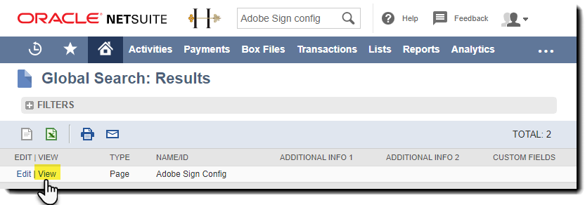

# [!DNL NetSuite] 설치 및 사용자 정의 안내서(v4.0.4) {#install-customize-NetSuite}

## 개요 {#overview}

Adobe Sign [!DNL NetSuite] 전자 서명과 [!DNL NetSuite]. Adobe Sign [!DNL NetSuite] 통합을 통해 전자 서명이 필요한 계약서, 견적서, 기타 문서 등의 계약서를 수신자에게 직접 전송 [!DNL NetSuite]. 고객, 리드, 견적 및 기타 업체로부터 Adobe Sign 계약을 생성하고 전송할 수 있습니다. [!DNL NetSuite] 있습니다. Adobe Sign 업데이트 [!DNL NetSuite] 계약 상태를 저장하고 계약 과 [!DNL NetSuite] 레코드가 완전히 실행된 후 다음에서 보낸 모든 계약의 기록을 볼 수 있습니다. [!DNL NetSuite] 선택할 수 있습니다.

자세한 내용은 [Adobe Sign for NetSuite 릴리스 정보](https://experienceleague.adobe.com/docs/sign-integrations/using/netsuite/release-notes.html?lang=en) 참조하십시오.

## 번들 설치 및 OAuth 구성 {#install}

오직 [!DNL NetSuite] 관리자는 번들을 설치하거나 업데이트할 수 있습니다. OAuth를 구성하려면 [!DNL NetSuite] 관리자는 Adobe Sign에 대한 관리자 액세스 권한을 가지고 있어야 합니다. 프로덕션 계정에 번들을 설치하기 전에 번들을 설치하고 테스트해야 합니다. [!DNL NetSuite] 샌드박스 계정입니다.

자세한 내용은 [Adobe Sign 계약 만들기](#createagreement) 를 참조하십시오.

>[!CAUTION]
>
>v4.0.4로 업그레이드하는 고객은 기존 API 키를 제거해서는 안 됩니다.
>
>자세한 내용은 [사용자 정의 환경 설정 지정](#configure) 를 참조하십시오.

### 처음으로 번들 설치

1. 다음으로 이동 [!UICONTROL **Customization > SuiteBundler > Search &amp; Install Bundles**].

1. 에 *번들 검색 및 설치* 페이지, 입력 **Adobe Sign** 키워드 및 select **[!UICONTROL 검색]**.

1. 다음을 선택합니다. **Adobe Sign** 번들 이름입니다.

   

1. 에 *[!UICONTROL 번들 세부 정보]* 페이지, 선택 **[!UICONTROL 설치]**.
1. 에 *[!UICONTROL 번들 설치 미리 보기]* 페이지, 선택 **[!UICONTROL 번들 설치]**.

   (페이지에서 기본값을 변경할 필요는 없습니다.)

   

1. 표시되는 설치 대화 상자에서 **[!UICONTROL 확인]** 진행합니다.

   설치 프로세스 중에 번들의 상태는 *[!UICONTROL 보류 중]*.

   

1. 업데이트된 상태를 표시하려면 **[!UICONTROL 새로 고침]**.

   번들 설치가 완료되면 *Adobe Sign[!DNL NetSuite]* 에 *[!UICONTROL 설치된 번들]* 페이지를 엽니다.

   

1. 이미 Adobe Sign 고객 계정인 경우 다음 단계를 따르십시오  [설치 또는 업그레이드 후 OAuth 구성](#oauth).

   Adobe Sign 계정이 없는 경우 [엔터프라이즈 평가판 등록](https://esign.adobe.com/adobe-sign-netsuite-trial-registration.html) 시스템을 테스트할 계정입니다. 온라인 등록 단계에 따라 Adobe Sign 계정을 활성화합니다.

## 설치 또는 업그레이드 후 OAuth 구성 {#oauth}

Adobe Sign은 OAuth 2.0을 사용하여 내에서 Adobe Sign 계정을 인증합니다. [!DNL NetSuite].

이 프로토콜은 설치된 [!DNL NetSuite] 번들을 사용하여 암호를 요청하지 않고도 Adobe Sign과 통신할 수 있습니다. 중요한 정보가 앱 간에 직접 공유되지 않으므로 계정이 손상될 가능성이 작습니다.

이 인증은 구현에는 영향을 주지 않지만 프로덕션 또는 샌드박스 계정에 번들을 설치하거나 업그레이드한 후 일회성 구성을 수행해야 합니다.

추가 [!DNL NetSuite] oauth를 구성하는 관리자에게도 Adobe Sign에 대한 계정 수준 관리자 액세스 권한이 있어야 합니다.

1. In [!DNL NetSuite]로 이동한 다음 *Adobe Sign 구성* 목록 페이지를 참조하십시오.

1. 검색 대상 **[!UICONTROL Adobe Sign 구성]** (사용자 정의 레코드 유형).

1. 검색 결과 페이지에서 **보기** 의 경우 *Adobe Sign 구성* 레코드.

   

1. Adobe Sign 구성 목록 페이지에서 **[!UICONTROL 보기]** 의 경우 *OAuth를 사용하여 Adobe Sign API 액세스* 레코드.

   

1. Adobe Sign 구성 페이지에서 **[!UICONTROL Adobe Sign으로 로그인]**

   

1. 표시되는 Adobe Sign 로그인 페이지에서 자격 증명을 입력하고 **[!UICONTROL 로그인]**.

   

1. 표시되는 액세스 확인 페이지(OAuth의 경우)에서 **[!UICONTROL 액세스 허용]**

   

1. 인증이 완료되면 [!DNL NetSuite]를 클릭합니다.

   

   >[!NOTE]
   >
   >Sandbox 계정에서 OAuth를 구성할 때 인증이 완료될 때 &quot;고객 comp ID를 확인할 수 없습니다&quot;라는 오류가 발생할 수 있습니다.
   >
   >
   >계속하려면 브라우저에서 URL의 계정 도메인 부분(system.netsuite.com)을 변경하여 [!DNL NetSuite] 샌드박스:
   >
   >
   >변경:
   >
   >
   >system.netsuite.com/app/site/hosting/scriptlet.nl?script=745&amp;deploy=1&amp;web_access_point=https://echosign.com
   >
   >
   >받는 사람:
   >
   >
   >있습니다.**샌드박스.** netsuite.com/app/site/hosting/scriptlet.nl?script=745&amp;deploy=1&amp;web_access_point=https://echosign.com

## 번들 업데이트(기존 사용자)

[!DNL NetSuite] 번들 업데이트는 Adobe에서 정기적으로 제공됩니다. Adobe Sign의 기존 사용자 [!DNL NetSuite] 통합을 최신 번들로 업데이트할 수 있습니다.

>[!CAUTION]
>
>최신 버전으로 업그레이드하는 고객은 기존 API 키를 제거하지 않아야 합니다.
>
>자세한 내용은 [사용자 정의 환경 설정 지정](#configure) 를 참조하십시오.

### 전제 조건 {#prerequisites}

v4.0.4 번들로 업데이트하는 데 필요한 시간은 현재 &#39;서명을 위해 전송됨&#39; 상태가 있는 계약 수에 따라 달라집니다. 일반적으로 100개의 계약을 업데이트하는 데 7~10분이 걸립니다. 업데이트 시간을 예측할 레코드 수를 기록해 두십시오.

서명을 받기 위해 전송된 계약서의 수를 확인하려면:

1. 다음으로 이동 **[!UICONTROL 사용자 정의 > 목록, 레코드 및 파일 > 레코드 유형]**&#x200B;을 눌러 *Adobe Sign 계약.*

   또는 검색 창에서 Adobe Sign 계약 을 검색합니다.

1. 의 경우 [!UICONTROL Adobe Sign 계약] 레코드, 선택 **[!UICONTROL 검색]**.

   

1. 원본 **[!UICONTROL 상태]** 드롭다운, 선택 **[!UICONTROL 서명을 위해 전송됨]** 그런 다음 **[!UICONTROL 제출]**.

   

   업데이트 시간을 예측할 레코드 수를 기록해 두십시오.

   

### 번들 업데이트 {#updating-the-bundle}

1. 다음으로 이동 **[!UICONTROL Customization > SuiteBundler > Search &amp; Install > List]** 아래 표시된 대로 현재 번들을 찾습니다.

   >[!NOTE]
   >
   >새 버전의 번들이 있는 경우 *버전* 현재 번들의 수입니다.

1. 작업 드롭다운 메뉴에서 **[!UICONTROL 업데이트]**.

   

1. 미리 보기 번들 업데이트 페이지에서 **[!UICONTROL 번들 업데이트]** 페이지에 표시된 기본값을 변경하지 않고

   설치하는 동안 번들의 상태는 *보류 중*.

   .

   >[!NOTE]
   >
   >번들을 업데이트할 때 아래와 같이 경고 메시지가 표시될 수 있습니다. 사용자 정의하지 않은 경우 [!DNL NetSuite] eSignature records, you can perform. 확실하지 않은 경우 프로덕션 계정에서 번들을 업데이트하기 전에 먼저 번들을 테스트하기 위해 샌드박스 계정에 번들을 설치하는 것이 좋습니다.

   

1. 업데이트된 상태를 표시하려면 **[!UICONTROL 새로 고침]**.

   

   >[!NOTE]
   >
   >XD와 *서명을 위해 전송됨* 상태, **[!UICONTROL 실행 로그]** 에 대한 하위 탭 *Adobe Sign 번들 설치* 업데이트 진행률을 결정하는 스크립트. 자세한 내용은 [업데이트 진행률 확인](#determineprogress) 참조하십시오.

   번들 업데이트가 완료되면 *Adobe Sign[!DNL NetSuite]* 에 *설치된 번들* 페이지를 엽니다.

   

## 번들 구성 {#configure}

### 사용자 정의 환경 설정 지정  {#set-custom-preferences}

사용자 정의 환경 설정을 사용하여 계약서 작성 및 저장 방법을 지정할 수 있습니다. [!DNL NetSuite]. 또한 *Adobe Sign에서 사용자 자동 프로비저닝* 환경 설정을 사용하여 [!DNL NetSuite] 사용자가 계약서를 전송할 때 Sign 서비스에서 자동 프로비저닝됨 [!DNL NetSuite].

1. 다음으로 이동 **[!UICONTROL 설정 > 회사 > 일반 환경설정]**.
1. 페이지를 아래로 스크롤한 다음 **[!UICONTROL 사용자 정의 환경 설정]** 하위 탭을 클릭합니다.

   

1. 필요에 따라 Adobe Sign 환경 설정을 활성화하고 구성합니다.

   * **계정에 대한 EchoSign API 키 입력**: 이 필드에 값을 추가하거나 편집하지 마십시오.
   * **상위 레코드 연락처를 서명자로 사용**: 활성화된 경우 계약이 생성될 때 상위 레코드 연락처가 기본적으로 첫 번째 서명자로 설정됩니다. 전송자는 보내기 전에 기본 서명자를 쉽게 제거 또는 편집하거나 계약서에 추가 서명자를 추가할 수 있습니다.
   * **Trans를 사용합니다. 서명자로 연락처(있는 경우)**: 이 환경 설정은 *상위 레코드 연락처를 서명자로 사용* 기본 설정도 사용할 수 있습니다. 활성화된 경우 트랜잭션 레코드에서 계약을 생성할 때(예: 견적) 기본 트랜잭션 연락처가 첫 번째 서명자로 기본 설정됩니다. 자세한 내용은 [트랜잭션 레코드](#transrecords) 참조하십시오. 기본 트랜잭션 연락처가 없거나 [!DNL NetSuite] 개체 레코드(예: 고객 레코드, 파트너 레코드). 기본 수신자는 고객 이메일의 기본 연락처입니다. 전송자는 보내기 전에 기본 서명자를 쉽게 제거 또는 편집하거나 계약서에 추가 서명자를 추가할 수 있습니다.
   * **수신자를 승인자로 표시 허용**: 활성화된 경우, 전송자는 수신자를 승인자로 표시할 수 있습니다. 승인자로 표시된 수신자는 계약을 검토하고 승인할 수 있지만, 서명할 필요는 없습니다. 승인자는 승인 프로세스 중에 필드에 데이터를 입력해야 할 수도 있습니다.
   * **기본 설정 계약 폴더 Id**: 서명된 최종 계약이 저장되는 폴더를 지정하는 데 사용됩니다. 이 필드에 값을 설정하지 않으면 최종 서명된 계약서는 기본적으로 원본 문서 파일과 같은 폴더에 저장됩니다. 폴더 ID는 숫자여야 합니다.
   * **트랜잭션 자동 첨부 PDF**: 사용으로 설정된 경우 트랜잭션 레코드에서 새 계약이 생성될 때 트랜잭션 PDF이 자동으로 계약에 첨부됩니다.
   * **서명된 PDF 추가(첨부 파일 또는 링크)**: 조건 *목록* 이 드롭다운에서 선택되면 서명된 PDF이 자동으로 파일에 대한 링크로 추가됩니다. 조건 *첨부 파일* 드롭다운에서 선택하면 서명된 PDF이 [!DNL NetSuite] 를 추가합니다.
   * **계약에 감사 추적 PDF 포함**: 활성화되면, 계약에 서명한 후 감사 추적 PDF이 계약 기록에 자동으로 첨부됩니다.
   * **ID 확인 방법 적용 대상**: ID 확인 방법 중 하나를 활성화하면 ID 확인 방법이 적용되는 대상이 됩니다. 옵션은 다음과 같습니다 *모든 서명자, 외부 서명자만*, 또는 *내부 서명자만*.

   **ID 확인 방법** {#identity-verification-methods}

   계약을 생성할 때 활성화된 ID 확인 방법을 선택할 수 있습니다. 여기에서 두 개 이상의 ID 확인 방법을 활성화하면 Adobe Sign 계약 페이지에 **[!UICONTROL 서명자 ID 확인]** 있습니다.

   * **서명에 필요한 암호 활성화**: 서명자에게 지정한 일회용 암호를 입력해야 합니다.

   * **지식 기반 인증 사용**: 서명자에게 SSN의 이름, 주소 및 마지막 네 자리(선택 사항)를 제공한 다음 제공된 정보를 확인하는 질문 목록에 응답하도록 합니다. 미국에서만 이용 가능

   * **웹 ID 인증 활성화**: 서명자가 다음 사이트 중 하나에 로그인하여 ID를 확인해야 합니다. Facebook, Google, LinkedIn, Microsoft Live, Twitter 또는 Yahoo!

   * **Adobe Sign에서 사용자 자동 프로비저닝**: 활성화된 경우 계약을 보내는 사용자 [!DNL NetSuite] Adobe Sign 사용자 계정으로 자동 프로비저닝됩니다.

1. 선택 **[!UICONTROL 저장]** 를 클릭하여 환경 설정을 저장합니다.

## 자동 상태 업데이트 구성 {#asu}

Adobe Sign 통합 번들을 사용하면 [!DNL NetSuite] 에서 보낸 계약 상태 관련 [!DNL NetSuite]. 이 기능이 활성화되면 [!DNL NetSuite] 항상 계약 상태를 반영합니다. 다음과 같이 자동 상태 업데이트를 활성화할 수 있습니다.

1. 다음으로 이동 **[!UICONTROL 설정 > 회사 > 기능 사용].**
1. 다음을 선택합니다. **[!UICONTROL SuiteCloud]** 하위 탭을 클릭합니다.
1. 다음 옵션을 활성화합니다.

   * SuiteBuilder 섹션에서 다음을 활성화합니다 **[!UICONTROL 사용자 지정 레코드]** 있습니다.

   * SuiteScript 섹션에서 **[!UICONTROL 클라이언트 SuiteScript]** 및 **[!UICONTROL 서버 SuiteScript]** 에 동의해야 합니다.

1. 선택 **[!UICONTROL 저장]**.

   옵션은 이미지에 표시된 대로 설정됩니다.

   

## 개체 및 레코드 유형 {#objects}

Adobe Sign 통합 번들은 이미 많은 표준을 사용하여 Adobe Sign 계약 개체를 노출합니다. [!DNL NetSuite] 객체: 고객, 예상, 리드, 기회 및 파트너 기록 Adobe Sign 번들을 사용자 정의 레코드를 비롯한 다른 레코드 종류와 함께 사용할 수도 있습니다.

계약 탭에는 [!DNL NetSuite] 레코드: 엔티티 및 트랜잭션 레코드. 일반적으로 트랜잭션 레코드는 PDF 문서로 변환할 수 있는 레코드(예: 견적)라고 가정합니다. 반면 엔터티 레코드는 PDF으로 변환할 수 없습니다.

## 트랜잭션 레코드 {#transrecords}

계약이 트랜잭션 레코드에서 생성된 경우 계약 레코드의 첫 번째 문서는 계약이 가져온 레코드의 PDF 버전이고 첫 번째 수신자는 레코드의 전자 메일 주소입니다. 첫 번째 문서가 출처인 레코드의 PDF 버전이 되지 않게 하려면 **[!UICONTROL 설정 > 회사 > 일반 환경설정 > 사용자 정의 환경설정 하위 탭]** 및 비활성화 **[!UICONTROL 트랜잭션 자동 첨부 PDF]** 있습니다. 자세한 내용은 [사용자 정의 환경 설정 지정](#configure) 참조하십시오.

사용자 정의 환경 설정에서 **[!UICONTROL Trans를 사용합니다. 첫 번째 서명자로 연락처]** 기본 트랜잭션 연락처를 첫 번째 서명자로 자동으로 추가하려면 이 옵션을 선택합니다. 트랜잭션 레코드와 연결하면 **[!UICONTROL 계약]** 및 **[!UICONTROL Send for Signature]** 단추를 클릭합니다.

## 엔터티 레코드 {#entity-records}

계약이 엔티티 레코드에서 생성된 경우 첫 번째 수신자는 레코드의 전자 메일 주소입니다. 엔티티 레코드와 연결되면 계약 탭만 표시됩니다.

## 번들 사용자 정의 {#customize}

번들 사용자 정의는 다음과 같습니다.

* 계약 하위 탭에 대한 스크립트 및 해당 레코드 유형에 대한 Send for Signature 단추를 배포합니다.
* Adobe Sign 레코드 유형에 대한 역할 권한을 설정합니다.
* 액세스 권한을 부여하도록 권한을 수정하는 중 *계약* 하위 탭과 *Send for Signature* 단추를 클릭합니다.

### 추가 레코드 유형에 대한 Adobe Sign 계약 구성  {#configuring-adobe-sign-agreements-for-additional-record-types}

를 배포하려면 *계약* 하위 탭과 *Send for Signature* 해당 레코드 유형에 대한 단추:

1. 다음으로 이동 **[!UICONTROL Customization > Scripting > Scripts].**

1. 에 *스크립트* 나타나는 목록 페이지에서 배치해야 할 스크립트를 찾은 다음 선택합니다. ****[!UICONTROL 보기]****.

   * 을 추가하려면 *Send for Signature* 단추, 선택 **[!UICONTROL Adobe Sign 추정 단추]** 스크립트.

   * 을 추가하려면 *계약* 탭, 선택 **[!UICONTROL Adobe Sign 계약 로더]** 스크립트.

1. 스크립트 페이지에서 **[!UICONTROL 스크립트 배포]**.

   

1. 스크립트 배포 페이지에서 다음을 수행합니다.

   * 원본 *적용 대상* 목록에서 레코드 유형을 선택합니다.
   * 필요한 경우 스크립트 배포 ID를 입력합니다.

      자세한 내용은 *사용자 정의 스크립트 배포 ID 만들기* 의 항목 [!DNL NetSuite] 자세한 내용은 도움말 센터를 참조하십시오. ID를 입력하지 않으면 ID가 생성됩니다.

   * 확인 **[!UICONTROL 배포됨]** 확인란을 선택합니다.

   

   * 설정 *상태* 에 **[!UICONTROL 릴리스됨]**.

      다음을 지정할 필요는 없습니다. *이벤트 유형* 또는 *로그 수준*.

   * 원본 [!UICONTROL *역할로 실행]* 드롭다운, 선택 **[!UICONTROL 관리자로 실행]**.

   * 및 **[!UICONTROL 대상]** 하위 탭 활성(기본적으로 활성), 액세스 권한을 부여할 특정 역할 또는 사용자를 선택합니다. 모든 역할 및 사용자에게 액세스 권한을 부여하려면 해당 **[!UICONTROL 모두 선택]** 있습니다.

   * 선택 **[!UICONTROL 저장]**. 변경 확인이 표시되면 **[!UICONTROL 돌아가기]**.

1. 선택 **[!UICONTROL 목록]** 을 눌러 *스크립트* 목록 페이지를 참조하십시오.
1. 다른 스크립트에 대해 위의 2~3단계를 반복합니다.

## Adobe Sign 레코드 유형에 대한 역할 권한 설정 {#setting-role-permissions-for-adobe-sign-record-types}

가장 [!DNL NetSuite] 역할에는 추가 사용자 정의 없이 Adobe Sign을 사용할 수 있는 권한이 있어야 합니다. 그러나 추가로 생성된 사용자 정의 역할에 대한 권한을 부여해야 할 수도 있습니다.

1. 다음으로 이동 **[!UICONTROL Customization > Lists, Records &amp; Files > Records Types]**.

   

   >[!NOTE]
   >
   >표시되지 않는 경우 *레코드 종류* 항목, **[!UICONTROL 설정 > 회사 > 기능 사용 > Suite Cloud 탭]** 및 활성화 *사용자 지정 레코드* 있습니다.

1. 에 *레코드 종류* 페이지, 선택 **[!UICONTROL Adobe Sign 계약]** 선택

   

1. 에 *사용자 지정 레코드 종류* 페이지, 선택 **[!UICONTROL 사용 권한 목록 사용]** 에서 *액세스 유형* 드롭다운

   

   >[!NOTE]
   >
   >추가 *Adobe Sign 계약* 레코드 유형은 Adobe Sign 레코드 유형 중 *사용 권한 목록 사용* 액세스 유형.
   >
   >
   >다른 Adobe Sign 레코드 유형에 대한 액세스 유형을 설정하는 방법은 6단계를 참조하십시오.

1. 다음을 선택합니다. **[!UICONTROL 권한]** 하위 탭을 클릭합니다.

   역할 및 권한 목록이 표시됩니다.

   

1. 다음에 추가된 사용자 정의 역할에 대한 권한을 다음과 같이 설정합니다.[!UICONTROL Adobe Sign 계약]&quot; 레코드 유형입니다.

   >[!NOTE]
   >
   >자세한 내용은 *[사용자 정의 레코드 유형에 대한 권한 목록 설정](https://system.netsuite.com/app/help/helpcenter.nl?fid=section_N2879931.html)* 자세한 내용은 NetSuite 도움말 센터 항목을 참조하십시오.

   1. 다음에서 역할을 선택합니다. *역할* 목록.
   1. 설정 *레벨* 에 **[!UICONTROL 전체]**.
   1. 설정 *기본 양식* 에 **[!UICONTROL 사용자 정의 EchoSign 계약 양식]**.
   1. 선택 **[!UICONTROL 양식 제한]** 확인란을 선택합니다.
   1. 선택 **[!UICONTROL 추가]** 역할 행의 변경 사항을 저장합니다.

   

   새 행이 아래와 같이 표시됩니다.

   

   모든 추가 사용자 정의 역할에 대해 위의 a-e 단계를 반복합니다.

   * 선택 **[!UICONTROL 저장]** 에 *사용자 지정 레코드 종류* 페이지를 엽니다.
   추가 *[!UICONTROL 고객 레코드 유형]* 페이지가 다시 표시됩니다.

1. 위의 1~3단계를 반복하여 *액세스 유형* 를 참조하십시오.

   **[!UICONTROL 권한이 필요하지 않습니다.].** 이는 다음 레코드 유형에 적용됩니다.

   * Adobe Sign 구성
   * Adobe Sign 문서
   * Adobe Sign 이벤트
   * Adobe Sign 언어
   * Adobe Sign 스크립트 오류
   * Adobe Sign 서명된 계약
   * Adobe Sign 서명자

### 계약 탭 및 Send for Signature 단추에 대한 액세스 권한 부여  {#granting-access-to-the-agreement-tab-and-send-for-signature-button}

Adobe Sign 통합 번들은 이미 많은 표준을 사용하여 Adobe Sign 계약 개체를 노출합니다. [!DNL NetSuite] 객체(고객, 추정 [견적], 리드 등). 추가 *계약* 하위 탭은 다음 유형의 객체에 대해 자동으로 활성화됩니다. 고객, 리드, 기회, 파트너, 잠재 고객, 견적 및 공급업체 청구서

추가 *[!UICONTROL Send for Signature]* 버튼이 자동으로 활성화됨 **o[!UICONTROL Quote 객체에만 해당]**.

[!DNL NetSuite] 관리자는 추가 CRM에 대한 추가 권한을 수정하여 계약을 생성하는 기능을 추가 CRM 개체까지 확장할 수 있습니다. *계약* 하위 탭, *Send for Signature* 버튼을 클릭하거나 두 객체를 모두 클릭합니다.

#### Send for Signature 단추에 대한 액세스 권한을 부여하도록 권한 수정  {#modifying-permissions-to-grant-access-to-the-send-for-signature-button}

1. 다음으로 이동 **[!UICONTROL Customization > Scripting > Scripts]**.

   추가 *스크립트* 목록 페이지가 표시됩니다.

   * 필요한 경우 필터를 사용하여 Adobe Sign 스크립트를 찾습니다

1. 에 *스크립트* 페이지, 찾기 *Adobe Sign 추정 단추* 스크립트(컨트롤 *Send for Signature* 단추)를 선택한 다음 **보기**.

   

1. 에 *스크립트* 페이지에서 다음을 수행합니다.

   * 선택 **[!UICONTROL 배포]** 하위 탭

   * 아래 &quot;*적용 대상*&quot; 수정할 엔티티의 링크를 선택합니다.

      * **[!UICONTROL 견적]** 이 예에서는

   ![[배포] 하위 탭을 선택합니다.](images/click-the-deploymentssub-tab.png)

   * 선택 **[!UICONTROL 편집]** 단추 *스크립트 배포* 페이지

   

   * 및 **[!UICONTROL 대상]** 활성 하위 탭에서 액세스 권한을 부여할 특정 역할을 선택합니다.

      * 모든 역할 및 사용자에게 액세스 권한을 부여하려면 해당 **[!UICONTROL 모두 선택]** 옵션
   * 선택 **[!UICONTROL 저장]**

   

#### 계약 탭에 대한 액세스 권한을 부여하기 위한 권한 수정  {#modifying-permissions-to-grant-access-to-the-agreements-tab}

1. 다음으로 이동 **[!UICONTROL Customization > Scripting > Scripts]**
1. 에 [!UICONTROL 스크립트] 페이지, 찾기 *[!UICONTROL Adobe Sign 계약 로더]* 스크립트(컨트롤 *계약 탭*)를 선택한 다음 **[!UICONTROL 보기]**.
1. 에 *스크립트* 페이지에서 다음을 수행합니다.

   1. 다음을 선택합니다. **[!UICONTROL 배포]** 하위 탭
   1. 아래 &quot;*[!UICONTROL 적용 대상]*&quot; 액세스 권한을 수정할 엔티티의 링크를 선택합니다.
   1. 에 *[!UICONTROL 스크립트 배포]* 페이지에서 **[!UICONTROL 편집]** 단추
   1. 및 **[!UICONTROL 대상]** 하위 탭 활성(기본적으로 활성), 액세스 권한을 부여할 특정 역할 또는 사용자를 선택합니다. 모든 역할 및 사용자에게 액세스 권한을 부여하려면 해당 **[!UICONTROL 모두 선택]** 옵션
   1. 선택 **[!UICONTROL 저장]**

## Adobe Sign 사용 [!DNL NetSuite] 번들

계약서를 보내려면 [!DNL NetSuite] 이러한 계약에 대한 업데이트를 받으려면 사용자에게 동일한 로그인 ID(전자 메일 주소)가 있어야 합니다. [!DNL NetSuite] 및 Adobe Sign에서 편집할 수 있습니다.

### Adobe Sign 계약 만들기

Sandbox 또는 Production 계정에 새 번들을 설치한 후에는 새 계약을 생성하여 번들을 테스트해야 합니다. 엔티티 레코드, 트랜잭션 레코드 또는 독립 실행형 계약에서 Adobe Sign 계약을 생성할 수 있습니다.

>[!NOTE]
>
>계약을 생성하는 프로세스는 계약을 생성하는 방법에 따라 약간 다릅니다. 일반 프로세스에는 계약 옵션을 지정하고, 하나 이상의 계약 문서를 추가하고, 수신자를 지정하는 작업이 포함됩니다. 아래 설명된 프로세스에서는 고객 레코드에서 계약을 생성하는 것으로 가정합니다.

1. 계약을 보낼 고객 레코드를 선택 또는 만들거나 다른 레코드를 선택할 수 있습니다. [!DNL NetSuite] [계약] 탭이 활성화된 레코드 유형입니다.

1. 레코드에서 **[!UICONTROL 계약]** 하위 탭을 클릭합니다.
1. 선택 **[!UICONTROL 새 계약]**.

   

1. 에 *[!UICONTROL Adobe Sign 계약]* 페이지, 선택 **[!UICONTROL 편집]**.

   

1. 다음과 같이 계약 옵션을 지정합니다.

   * **계약 이름** — 계약 이름을 입력합니다.
   * **메시지**- 수신자에 대한 사용자 정의 메시지를 입력합니다.
   * **서명 유형** — 문서에 사용할 수 있는 서명 유형을 선택합니다. 옵션은 다음과 같습니다 *전자 서명* 및 *팩스 서명*.

   * **이 계약서에 서명해야 합니다.** — 발신자도 계약에 서명해야 함을 나타내려면 이 옵션을 활성화합니다.
   * **서명 순서**- *이 계약서에 서명해야 합니다.* 이 옵션이 활성화되어 있으면 전송자와 수신자가 서명해야 하는 순서를 선택합니다. 옵션에는 &quot;I sign, recipients sign&quot;, &quot;recipients sign, then I sign&quot; 및 &quot;None&quot;이 있습니다.

   * **문서 또는 직위 서명 미리 보기(또는 양식 필드)** — 이 옵션을 활성화하면 전송자가 계약을 미리 볼 수 있고 수신자에게 전송되기 전에 계약에 필드(서명 드래그하여 놓기, 이니셜 필드 및 기타 양식 필드)를 추가할 수 있습니다.
   * **서명자 ID 확인** — 이 옵션을 활성화한 후 다음 ID 확인 옵션 중 하나를 선택합니다

      * 이 옵션은 아래 나열된 세 가지 서명자 ID 확인 방법 중 둘 이상이 사용자 정의 기본 설정에서 활성화된 경우에만 표시됩니다. (자세한 내용은 [사용자 정의 환경 설정 지정](#customize) 참조하십시오.) 하나의 환경 설정만 활성화되어 있는 경우 **[!UICONTROL 서명자 ID 확인]** 옵션이 표시되지 않습니다.

   **ID 확인 방법**

   * **서명에 필요한 암호** — 지정된 일회용 암호를 입력해야 합니다.
   * **지식 기반 인증** — 서명자에게 SSN의 이름, 주소 및 마지막 네 자리(선택 사항)를 제공한 다음 제공된 정보를 확인하는 질문 목록에 응답하도록 합니다. 미국에서만 이용 가능
   * **웹 ID 인증** — 서명자가 다음 사이트 중 하나에 로그인하여 ID를 확인해야 합니다. Facebook, Google, LinkedIn, Twitter, Yahoo! 또는 Microsoft 라이브
   * **PDF을 보는 데 필요한 암호** — 수신자가 계약 또는 서명된 계약의 PDF을 열기 전에 암호를 입력하도록 하려면 이 옵션을 활성화합니다. 모든 사람에게 전송되는 PDF 파일은 암호화되어 있으며 파일을 열려면 암호가 필요합니다. 복구할 수 없으므로 암호를 잃지 마십시오. 암호를 잊어버린 경우 해당 트랜잭션을 삭제하고 다시 시작해야 합니다.
   * **암호/암호 확인** — *PDF을 보는 데 필요한 암호* 옵션이 활성화된 경우 계약을 보는 데 사용할 암호를 입력합니다.
   * **수신자에게 서명 알림** — 수신자에게 알림 메시지를 전송할지 여부와 전송 빈도를 지정합니다. 옵션은 다음과 같습니다 *안함*, *매일* 또는 *매주*.
   * **언어:** 서명 페이지와 전자 메일 알림이 수신자에게 표시되는 언어를 지정합니다.
   * **첫 번째 서명자에 대한 호스트 서명** — 발신자가 첫 번째 서명자에 대해 직접 서명을 호스트하도록 허용하려면 이 옵션을 활성화합니다.
   * **서명 기한까지 남은 일 수** — 정수를 입력하여 계약의 서명 기한(오늘 날짜 + 일수)을 나타냅니다.
   * **상위 레코드** — 선택적으로 상위 레코드를 선택하여 계약에 연결합니다.

   

1. 다음을 선택합니다. **[!UICONTROL 문서]** 탭합니다.

   

1. 에 *문서* 하위 탭에서 파일 캐비닛의 기존 문서를 *Adobe Sign 문서* 드롭다운 메뉴에서 **[!UICONTROL 첨부]**.

   또는 **[!UICONTROL 새 Adobe Sign 문서]** 를 클릭하여 *[!UICONTROL Adobe Sign 문서]* 페이지를 선택한 다음 문서의 이름을 [!DNL NetSuite] 파일 캐비닛을 선택하고 트랜잭션 레코드에서 파일을 선택하거나(해당하는 경우) 새 문서를 첨부합니다.

   계약에 여러 문서를 추가할 수 있습니다.

1. 선택 **[!UICONTROL 수신자]** 하위 탭을 누르고 연락처 목록에서 선택하거나 전자 메일 주소를 입력하여 수신자를 지정합니다.

   

   각 수신자는 서명자 또는 참조로 표시할 수 있습니다. 만약 *수신자를 승인자 서명자로 표시 허용* 사용자 정의 기본 설정이 활성화되어 있으면 수신자를 승인자로 표시할 수도 있습니다. 자세한 내용은 [사용자 정의 환경 설정 지정](#customize) 참조하십시오.

   * **서명자** 계약서에 서명해야 합니다.
   * **승인자** 계약서를 승인해야 하지만 서명해서는 안 되며, 선택적으로 계약서에 데이터를 추가해야 할 수도 있습니다.
   * **참조된 수신자** 계약 업데이트 및 계약이 서명되고 완료되었다는 알림을 받습니다. CC 수신자는 서명 또는 승인 프로세스의 당사자가 아닙니다.

      만약 *상위 레코드 연락처를 서명자로 사용* 사용자 정의 환경 설정이 단독으로 또는 함께 활성화됨 *Trans를 사용합니다. 서명자로 연락처* 기본 설정에서 첫 번째 수신자가 기본값으로 설정되지만 변경할 수 있습니다.

1. 선택 **[!UICONTROL 추가]** 각 수신자를 입력한 후.

1. 선택 **[!UICONTROL 저장]** 계약서를 저장합니다.

### 서명을 위해 계약 보내기

계약을 보낼 준비가 되면 **[!UICONTROL Send for Signature]** 단추를 클릭합니다.

* 만약 *문서 또는 직위 서명 미리 보기* 옵션이 활성화된 경우 **[!UICONTROL Send for Signature]**. 열린 창에서 문서를 미리 보거나 양식 필드를 보내기 전에 문서로 드래그합니다. 선택 **[!UICONTROL 전송]** 수신자에게 계약을 보냅니다.

* 만약 *[!UICONTROL 첫 번째 서명자에 대한 호스트 서명]* 옵션이 활성화된 경우 **[!UICONTROL Send for Signature]**. 열린 창에서 서명자가 발신자가 있는 문서에 서명할 수 있도록 허용합니다.

   A *현재 서명자에 대한 호스트 서명* 링크 옆에 *첫 번째 서명자에 대한 호스트 서명* 필드에 액세스할 수 있습니다. 이 링크를 사용하여 여러 서명자에 대한 계약 서명을 호스팅하거나 팝업 창이 실수로 닫히면 다시 열 수 있습니다.

계약서가 전송되면 수신자는 서명 대기 중인 문서를 알리는 전자 메일을 받습니다.

수신자가 문서에 서명한 후 발신자는 전자 메일로 문서가 서명되었다는 알림을 받습니다.

#### 견적에서 전송

Adobe Sign은 [!DNL NetSuite] 견적 PDF이 자동으로 생성되어 계약 레코드에 첨부되도록 합니다.

Quote 를 볼 때 **[!UICONTROL Send for Signature]**. 계약에 첨부된 견적을 생성하고 표시합니다. 또한 *Send for Signature* 버튼을 눌러 다른 트랜잭션 레코드 유형을 선택합니다. 자세한 내용은 [개체 및 레코드 유형](#objects) 참조하십시오.

### 상태 추적 및 알림 메시지 전송

계약서를 보낸 후:

* 문서 상태가 로 변경됩니다. *서명을 위해 전송됨* 를 클릭합니다.
* 추가 *Send for Signature* 단추가 다음 세 개의 단추로 바뀝니다.

   * **업데이트 상태** — 상태 업데이트가 구성되지 않은 경우 상태를 수동으로 업데이트합니다. 자세한 내용은 [자동 상태 업데이트 구성](#asu) 참조하십시오.
   * **알림 메시지 전송** — 현재 서명자에게 알림 메시지를 보냅니다.
   * **계약 취소** — 계약을 취소합니다. 모든 수신자가 아직 서명하지 않은 경우 서명을 받기 위해 계약을 보낸 후 계약이 취소될 수 있습니다.

새로운 *이벤트* 하위 탭은 계약 레코드에 표시되며 계약의 상태를 추적할 수 있습니다.

계약을 전송, 확인 및 서명한 시간에 대한 정보가 포함된 계약 이벤트 내역을 확인할 수 있습니다.

계약에 서명한 후:

* 상태가 로 변경됩니다. *서명됨*.
* 링크를 사용하여 이 계약에 대한 상위 레코드에 다시 연결할 수 있습니다.
* 서명된 문서 및 감사 추적에서 &quot;다운로드&quot; 링크를 사용하여 이러한 문서에 액세스할 수 있습니다.
* 추가 *서명된 문서* 서명된 문서의 축소판을 보려면 하위 탭이 표시됩니다.

>[!NOTE]
>
>서명을 받을 계약서를 보낸 후에는 기록을 편집할 수 없습니다. 이는 사건의 기록을 보존하기 위함이다.

## 번들 제거

번들을 제거하려면 [!DNL NetSuite] 도움말. 자세한 내용은 *[번들 제거](https://docs.oracle.com/en/cloud/saas/netsuite/ns-online-help/section_N3400972.html)* 의 항목 [!DNL NetSuite] 자세한 내용은 도움말 센터를 참조하십시오.

번들을 제거하면 서명되지 않은 계약도 삭제됩니다. 서명된 계약 및 해당 감사 PDF 파일은 영향을 받지 않습니다.

서명되지 않은 계약을 유지해야 하는 경우 번들을 제거하지 마십시오.

## 문제 해결

### 업데이트 진행률 확인 {#determineprogress}

업데이트가 오래 걸리는 것으로 나타나면 Adobe Sign 번들 설치 스크립트의 실행 로그 하위 탭을 확인하여 다음과 같이 업데이트 진행률을 확인할 수 있습니다.

1. 다음으로 이동 **[!UICONTROL Customization > Scripting > Scripts]**.
1. 에 [!UICONTROL 스크립트] 페이지, 찾기 *[!UICONTROL Adobe Sign 번들 설치]* 스크립트, 선택 **[!UICONTROL 편집]**.
1. 에 [!UICONTROL 스크립트] 페이지에서 **실행 로그** 하위 탭을 클릭합니다.
1. 선택 **새로 고침**.

   실행 로그가 업데이트되어 상태를 반영합니다. 추가 *세부 정보* 열에 계약 업데이트 진행 상태가 표시됩니다.

   

### 액세스 토큰 문제 해결

계약과 상호 작용할 때 &quot;제공된 액세스 토큰이 잘못되었거나 만료되었습니다.&quot;라는 메시지가 나타날 수 있습니다.

이 오류는 다음과 같은 이유로 발생할 수 있습니다.

* 추가 [!DNL NetSuite]/Adobe Sign OAuth를 구성한 관리자가 액세스 토큰을 해지했습니다.
* 다음에서 계약을 보내지 않았으므로 액세스 토큰이 만료되었습니다. [!DNL NetSuite] 지난 60일간
* 추가 [!DNL NetSuite]/Adobe Sign 관리자가 초기 OAuth 구성을 완료하지 못했습니다.

이 문제를 해결하려면 OAuth 구성 프로세스를 다시 실행하십시오. 자세한 내용은 [설치 또는 업그레이드 후 OAuth 구성](#oauth) 참조하십시오.

### 문서 상태 문제 해결 {#resolvestatus}

조건 [자동 상태 업데이트](#asu) 은(는) 구성되었지만 계약을 보낸 후 계약 상태가 업데이트되지 않습니다. 다음을 시도하십시오.

1. 배포 실행 로그에서 *Adobe Sign 외부 업데이트* 다음과 같이 Adobe Sign에서 호출을 수신하는지 확인하는 스크립트:

   1. 다음으로 이동 **[!UICONTROL Customization > Scripting > Script Deployments]**
   1. 에 *스크립트 배포* 페이지, 찾기 *Adobe Sign 외부 업데이트* 스크립트, 선택 **[!UICONTROL 편집]**
      1. 에 *[!UICONTROL 스크립트 배포]* 페이지에서 **[!UICONTROL 실행 로그]** 하위 탭을 클릭합니다.
      * PDF 파일이 *업데이트된 계약 레코드* 각 계약 ID에 대한 항목

1. 배포 실행 로그에서 *Adobe Sign 업데이트 계약* 스크립트에서 다음과 같은 오류가 있는지 확인합니다.

   1. 다음으로 이동 **[!UICONTROL Customization > Scripting > Script Deployments]**.
   1. 에 [!UICONTROL 스크립트 배포] 페이지, 찾기 *[!UICONTROL Adobe Sign 업데이트 계약]* 스크립트에[!UICONTROL 예약]&quot; 상태, 선택 **[!UICONTROL 편집]**.
   1. 에 [!UICONTROL 스크립트 배포] 페이지에서 **[!UICONTROL 실행 로그]** 하위 탭을 클릭합니다.
   1. 아래 [!UICONTROL 유형], 선택 **[!UICONTROL 오류]** 를 눌러 결과를 필터링합니다.

1. 마지막으로 *Adobe Sign 관리자* 위 2단계의 지침에 따라 오류 스크립트를 작성합니다.

### MIME 유형 오류 해결  {#resolving-mime-type-errors}

계약을 보낼 때 MIME 유형 오류가 발생하는 경우 파일 이름 필드의 이름이 업로드된 파일의 파일 이름 및 확장자와 일치하지 않기 때문일 수 있습니다. [파일 이름] 필드를 비워 두면 올바른 파일 이름과 확장명으로 자동으로 채워집니다.

### 스크립트 로그 보기 {#viewing-script-logs}

문서 상태 문제와 관련이 없는 스크립트의 배포 실행 로그를 볼 수도 있습니다. 자세한 내용은 [문서 상태 문제 해결](#resolvestatus) 참조하십시오.

1. 다음으로 이동 **[!UICONTROL Customization > Scripting > Scripts]**.

   추가 *스크립트* 목록 페이지가 표시됩니다. 필요한 경우 필터를 사용하여 적절한 스크립트를 찾습니다.

1. 선택 **[!UICONTROL 보기]** 반환합니다.

1. 다음을 선택합니다. **[!UICONTROL 실행 로그]** 페이지의 하위 탭에서 스크립트 로그를 표시합니다.

## 지원 {#support}

다음으로 이동 [Adobe Sign 지원 포털](https://adobe.com/go/adobesign-support-center) FAQ, 설명서, 기술 자료 문서에 액세스하거나 Adobe 지원에 문의하십시오.
