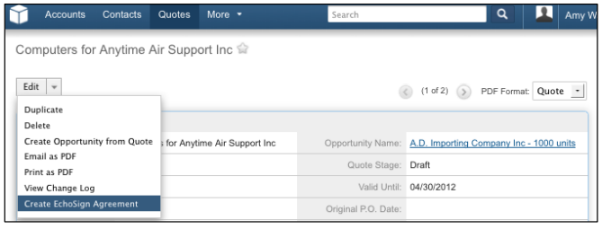

# [!DNL SugarCRM] 설치 안내서 {#sugarcrm-install-guide}

[고객 지원 센터에 문의](https://adobe.com/go/adobesign-support-center)

Adobe [!DNL EchoSign] 에 [!DNL SugarCRM] 전자 서명 자동화를 제공하는 선도적인 전자 서명 및 웹 계약 솔루션입니다. [!DNL SugarCRM] 전자 서명 및 팩스 서명에 사용됩니다. 사용자는 SugarCRM에서 직접 계약서를 보내고, 계약 내역을 보고, 연결된 계정, 연락처, 견적 등과 함께 전자 서명한 계약서를 저장할 수 있습니다.
Adobe [!DNL EchoSign] 에 [!DNL SugarCRM] 주문형 또는 온프레미스 솔루션용 6.3 - 6.7을 포함하여 지원되는 모든 버전의 SugarCRM에서 사용할 수 있습니다.

이 문서는 [!DNL SugarCRM] Adobe 설치 및 구성 방법에 대한 관리자 [!DNL EchoSign] 에 [!DNL SugarCRM] 플러그인.

## 이 플러그인 설치 {#install-plugin}

1. Adobe 가져오기 [!DNL EchoSign] 에 [!DNL SugarCRM]  의 아카이브 파일 [SugarExchange 목록](http://www.sugarexchange.com/product_details.php?product=1123).
1. 로그인 [!DNL SugarCRM] 관리자 계정으로 로그인합니다.
1. 이동 **[!UICONTROL 관리]** > **[!UICONTROL 모듈 로더]**.

   

1. Adobe의 아카이브 파일을 업로드하려면 [!DNL EchoSign] 에 [!DNL SugarCRM] 플러그인, 선택 **[!UICONTROL 찾아보기]**&#x200B;아카이브 파일을 선택한 다음 **[!UICONTROL 업로드]**.
1. 보관 파일이 업로드되면 **[!UICONTROL 설치]** 설치를 시작합니다.
1. 약관을 검토한 다음 **[!UICONTROL 수락]** > **[!UICONTROL 커밋]**.
1. 플러그인이 성공적으로 설치되면 진행률 표시줄에 100% 성공으로 표시됩니다.  진행률 표시줄이 100%에 도달하지 않으면 **[!UICONTROL 로그 표시]** SugarCRM에서 발생한 오류를 확인합니다.

   

1. 설치 후 **[!UICONTROL 관리 > 복구]** 및 선택 **[!UICONTROL 빠른 복구 및 재구축]**.

>[!NOTE]
>
>플러그인을 설치하는 경우 [!DNL SugarCRM] OnDemand를 사용하여 [!DNL SugarCRM] 패키지를 설치할 수 있도록 OnDemand용 패키지 관리자의 제한을 일시적으로 제거합니다. 이는 표준 프로세스의 일부입니다.

## 플러그인 업그레이드 {#upgrade-plugin}

Adobe을 업데이트하는 경우 [!DNL EchoSign] 에 [!DNL SugarCRM] 플러그인을 최신 버전으로 사용하려면 이전 버전을 제거하지 않고 플러그인을 설치해야 합니다.
플러그인을 업그레이드한 후 **[!UICONTROL 관리]** > **[!UICONTROL 복구]** 및 선택 **[!UICONTROL 빠른 복구 및 재구축]**.

**참고:** 이전 플러그인을 제거하는 경우 제거하는 동안 테이블을 제거하지 마십시오. 그렇지 않으면 [!DNL EchoSign] 계약 데이터입니다.

## 플러그인 구성 {#configure-plugin}

1. 이미 Adobe의 경우 [!DNL EchoSign] customer, 2단계를 계속 진행합니다.

   PDF 파일이 없는 경우 [!DNL EchoSign] 계정, [14일 무료 체험판 등록](https://sugarcrmintegration.echosign.com/public/login) 온라인 Adobe 단계에 따라 등록을 활성화하십시오 [!DNL EchoSign] 있습니다.
1. 로그인 [Echo Sign 계정](http://www.echosign.com) 다음 단계를 따르십시오.
   1. 선택 **[!UICONTROL 계정]** 탭합니다.
   1. 선택 **[!UICONTROL EchoSign API]** 왼쪽 하단에 있습니다.
   1. 선택 **[!UICONTROL API 액세스 사용]** 페이지에서 API 키를 가져옵니다.

   

1. SugarCRM에서 **[!UICONTROL 관리]** > **[!UICONTROL Adobe EchoSign 설정]** 라는 레이블이 지정된 필드에 API 키를 입력합니다 **[!UICONTROL EchoSign API 키]**.
1. 선택적으로 다음 설정으로 플러그인을 구성합니다.

   1. 견적에서 계약을 생성할 때 자동으로 PDF 첨부: 견적의 PDF을 자동으로 첨부할지 여부를 선택합니다. [!DNL SugarCRM] 사용자가 Quotes 모듈에서 EchoSign 계약을 작성합니다.
   1. 수신자 목록 관리: 수신자 하위 패널에 표시할 모듈 선택 [!DNL EchoSign] 계약 모듈. 또한 [!DNL EchoSign] 계약 하위 패널에서 해당 모듈로
   1. 다음 모듈에 전송 단추를 추가합니다. 만들기 [!DNL EchoSign] Quote 모듈의 기본 작업에 포함할 계약 단추/작업
   1. 선택 **[!UICONTROL 저장]** 설정을 저장합니다.

**참고:** Adobe [!DNL EchoSign] 에 [!DNL SugarCRM] 플러그인을 사용하려면 [PHP SOAP 확장](http://www.php.net/manual/en/book.soap.php). SOAP 지원을 활성화하려면 enable-soap를 사용하여 PHP를 구성하십시오.

## 계약 업데이트 받기( [!DNL SugarCRM] 버전 6.3 이상) {#get-agreement-updates}

버전 6.3 이상의 경우 다음 두 가지 옵션을 사용하여 계약을 업데이트할 수 있습니다. 이전 버전의 SugarCRM에서는 플러그인이 기본적으로 콜백 메서드(옵션 1)만 제공합니다.

### 옵션 1. EchoSign에 업데이트를 푸시하기 위한 콜백 메서드 설정

웹 사이트가 공개 사이트인 경우 Adobe EchoSign에서 [!DNL SugarCRM] 인스턴스를 만듭니다. [!DNL SugarCRM] 그런 다음 계약 상태, 이벤트를 업데이트하고 서명된 문서(서명된 경우)를 자동으로 실시간으로 다운로드합니다. (방화벽을 사용하는 경우 [!DNL EchoSign] 서버 IP 주소를 사용하거나 이 안내서의 다음 섹션에 설명된 EchoSign 계약을 업데이트하는 예약된 작업 방법을 사용하십시오.)

1. 이동 **[!UICONTROL 관리]** > **[!UICONTROL Adobe EchoSign 설정]**.
1. 확인란을 선택합니다. **[!UICONTROL EchoSign 콜백 메서드 사용]** 계약 상태 및 이벤트를 업데이트합니다.
1. 선택 **[!UICONTROL 저장]**.

### 옵션 2. 예약된 작업 설정 [!DNL SugarCRM] 방화벽 내의 인스턴스

추가 [!DNL EchoSign] 에 [!DNL SugarCRM] 플러그인은 예약된 작업을 사용하여 쿼리할 수도 있습니다. [!DNL EchoSign] 서명을 받기 위해 전송된 계약에 대한 업데이트의 경우. 온-프레미스 작업 쿼리 방법이 있는 경우 예약된 작업 쿼리 방법을 사용할 수 있습니다. [!DNL SugarCRM] 방화벽 뒤에 설치

설정하려면 다음을 수행하십시오.

1. 이동 **[!UICONTROL 관리]** > **[!UICONTROL 스케줄러]**.
1. 탭 드롭다운 메뉴에서 **[!UICONTROL 스케줄러 만들기]**.
1. 작업명을 입력합니다.
1. 작업 필드에서 **[!UICONTROL Adobe EchoSign 상태 업데이트 프로그램]**.
1. 필요한 만큼 자주 실행되도록 작업을 설정합니다. 10분마다 실행되도록 설정하는 것이 좋습니다. 즉, 계약이 열려 있거나, 읽거나, 서명된 후에는 최대 10분 동안 실행될 수 있습니다. [!DNL SugarCRM] 이 정보로 업데이트할 예정입니다.

   **참고:** 서명이 필요한 계약이 많은 경우 너무 자주 실행하면 시스템 속도가 느려질 수 있습니다.

   

1. 이동 **[!UICONTROL 관리]** > **[!UICONTROL Adobe EchoSign 설정]**.
1. 상자 선택 해제 **[!UICONTROL EchoSign 콜백 메서드 사용]** 계약 상태 및 이벤트를 업데이트합니다.
1. 선택 **[!UICONTROL 저장]**.
참고: 스케줄러 설정 [!DNL SugarCRM] 있습니다.

EchoSign 계약을 다른 계약에 추가하려면 [!DNL SugarCRM] 모듈:

1. 이동 **[!UICONTROL 관리]** > **[!UICONTROL Studio]**.
1. 왼쪽 열 폴더 트리에서 추가할 모듈을 선택합니다 [!DNL EchoSign] 계약.
1. 선택 **[!UICONTROL 관계]**> **[!UICONTROL 관계 추가]**.
1. 드롭다운 메뉴에서 다음과 같이 입력 을 선택합니다. **[!UICONTROL 1 대 다]** 및 모듈 형식 **[!UICONTROL EchoSign 계약]**.
1. 선택 **[!UICONTROL 저장 및 배포]**.

   

   [!DNL EchoSign] 이제 계약이 모듈에 나타나고 여기에서 계약을 생성하고 추적할 수 있습니다.

   

**기타 구성 단계**

* **숨기기 [!DNL EchoSign] 모듈**: 다음을 숨길 수 있습니다. [!DNL EchoSign] 수신자 및 [!DNL EchoSign] 관리&quot; 표시 모듈 탭 및 하위 패널로 이동하여 숨겨진 열로 이동하여 이벤트 모듈입니다.
* **packageScan 비활성화**: 자체 시스템에서 packageScan을 활성화한 경우 설치하는 동안 이를 비활성화해야 합니다. 를 사용하는 경우 [!DNL SugarCRM] 온디맨드, 문의 [!DNL SugarCRM] packageScan을 비활성화할 수 있습니다.

## 플러그인 제거 {#uninstall-plugin}

1. 로그인 [!DNL SugarCRM] 관리자 계정으로 로그인합니다.
1. 이동 **[!UICONTROL 관리]** > **[!UICONTROL 모듈 로더]**.
1. 선택 **[!UICONTROL 제거]** 옆에 [!UICONTROL SugarCRM용 EchoSign 플러그인].
1. 선택 **[!UICONTROL 커밋]** 를 클릭하십시오. 플러그인용으로 만든 데이터베이스 테이블을 제거하도록 선택할 수도 있습니다.

   

   플러그인이 성공적으로 제거되면 진행률 표시줄에 100% 성공으로 표시됩니다. 진행률 표시줄이 100%에 도달하지 않으면 [!UICONTROL 로그 표시] SugarCRM에서 발생한 오류를 확인합니다.

   

## Adobe 사용 [!DNL EchoSign] 에 [!DNL SugarCRM] {#use-echosign-for-sugarcrm}

Adobe을 만들 수 있습니다 [!DNL EchoSign] 계정, 연락처, 견적 또는 기타 사항과 연결된 계약 [!DNL SugarCRM] 모듈로 구성됩니다. 파일을 첨부하고, 수신자를 지정하고, 서명을 위해 보낼 수 있습니다. Adobe [!DNL EchoSign] 업데이트 [!DNL SugarCRM] 계약서의 현재 상태를 사용하여 서명된 계약서를 [!DNL SugarCRM] 이 파일이 완전히 실행되면

### Adobe 만들기 및 편집 [!DNL EchoSign] 계약 {#create-edit-agreements}

다음을 통해 계약을 생성할 수 있습니다. [!DNL EchoSign] 계약 모듈 또는 [!DNL SugarCRM] 책임자입니다.

1. 원본 [!UICONTROL 작업] 목록에 [!UICONTROL EchoSign 계약] 탭, 선택 **[!UICONTROL EchoSign 계약 만들기]**.
1. 의 메인 [!DNL EchoSign] 계약, 다음 정보를 입력하거나 다양한 계약 옵션 중에서 선택합니다.

   1. **[!UICONTROL 이름:]** 계약 이름을 입력합니다.
   1. **[!UICONTROL 서명 유형:]** 문서에 허용되는 서명 유형을 선택합니다. 전자 서명 및 팩스 서명 옵션이 있습니다.
   1. **[!UICONTROL 이 계약서에도 서명해야 합니다.]** 발신자도 계약에 서명해야 하는지 여부를 나타냅니다.
   1. **[!UICONTROL 서명 순서:]** [이 계약서에 서명해야 합니다.]라는 이전 옵션이 선택되어 있는 경우, 전송자와 수신자가 서명해야 하는 순서도 선택합니다.
   1. **[!UICONTROL 수신자에게 서명 알림:]** 수신자에게 문서에 서명할 것을 알리는 빈도를 선택합니다. 옵션은 [매일] 또는 [매주]입니다.
   1. **[!UICONTROL 서명 기한까지 남은 일 수:]** 계약에 서명해야 할 날까지의 일수를 지정합니다.
   1. **[!UICONTROL 미리 보기, 직위 서명 또는 양식 필드 추가:]**  계약을 전송하기 전에 미리 보거나 수신자에게 보내기 전에 서명 필드, 이니셜 필드 또는 다른 양식 필드를 계약으로 드래그하여 놓으려면 이 옵션을 선택합니다. 문서를 미리 보거나 원하는 필드를 문서로 드래그한 후에는 전송 단추를 선택하여 계약을 수신자에게 보내야 합니다.
   1. **[!UICONTROL 첫 번째 서명자에 대한 호스트 서명:]** 발신자가 계약 서명을 직접 호스팅할지 여부를 나타냅니다.
      * **[!UICONTROL 메시지:]** 수신자를 위한 메시지를 포함합니다.
      * **[!UICONTROL 계정, 기회, 견적:]** 이 계약과 연결된 계정, 기회 또는 견적을 선택하거나 수정합니다.
      * **[!UICONTROL 언어:]** 서명 페이지와 전자 메일 알림이 수신자에게 표시되는 언어를 지정합니다.

      

1. 에 [!UICONTROL 보안 옵션] 섹션 [!UICONTROL EchoSign 계약]에서 다음 정보를 입력합니다.

   a) **[!UICONTROL 서명에 필요한 암호:]** 수신자가 문서에 서명하기 전에 암호를 입력해야 하는지 여부를 나타냅니다.
b) **[!UICONTROL 여는 데 필요한 암호:]** 수신자가 계약 또는 서명된 계약의 PDF을 열기 전에 암호를 입력해야 하는지 여부 표시 c) **[!UICONTROL 암호:]** 문서를 열거나 서명하는 데 사용할 암호를 지정합니다.
d) **[!UICONTROL 암호 확인:]** 문서에 서명하거나 문서를 여는 데 사용할 암호를 확인합니다.

1. 의 다른 섹션에 있는 [!DNL EchoSign] 계약, 다음 정보를 입력합니다.

   a) **[!UICONTROL 사용자:]** 다음을 지정합니다. [!DNL SugarCRM] 있습니다. 기본값은 현재 시스템에 로그인한 사용자입니다.
b) **[!UICONTROL 팀:]** 기본 팀 지정을 변경하려면 새 기본 팀의 이름을 입력합니다. 레코드에 추가 팀을 할당하려면 **[!UICONTROL 선택]** 팀 목록에서 팀을 선택하거나 **[!UICONTROL 다음에 추가]** 팀 필드를 추가하고 팀 이름을 입력하려면 자세한 내용은 [!DNL SugarCRM] 응용 프로그램 안내서.

1. 선택 **[!UICONTROL 저장]**.

### [!DNL EchoSign] 계약 세부 정보 보기 {#agreement-detail-view}

이후 [!DNL EchoSign] 계약서가 저장되면 계약의 세부 정보 보기에 다음과 같은 하위 패널이 포함됩니다.

* **[!UICONTROL 수신자:]** 이 하위 패널에 나열된 모든 연락처는 [문서] 하위 패널에 지정된 문서를 수신합니다. 계약을 보내기 전에 한 명 이상의 수신자를 추가해야 합니다.
* **[!UICONTROL 문서:]** 새 문서를 업로드하거나 이미 업로드된 문서를 선택합니다. [!DNL SugarCRM] 서명을 위해 전송하려면
* **[!UICONTROL 이벤트:]** 서명을 위해 계약을 보낸 시기, 본 시기 또는 서명한 시기 등 계약과 관련된 모든 조치는 이 하위 패널에 나열됩니다.
를 편집하려면 [!DNL EchoSign] 계약, [!UICONTROL 편집] 단추 [!UICONTROL 세부 정보 보기] 수정했습니다.

**참고:** 서명을 받을 계약서를 보낸 후 [!UICONTROL 편집] 이벤트 레코드를 유지하기 위해 세부 정보 보기에서 버튼이 제거됩니다. 그러나 편집 단추를 활성화할 수 있습니다. 이렇게 하려면 [!UICONTROL 관리] > [!UICONTROL Adobe EchoSign 설정] 옵션을 선택 취소합니다. *[!UICONTROL 서명을 받을 계약서를 보낸 후에 편집 또는 삭제 기능을 비활성화합니다.]*.

### 문서에 문서 추가 [!DNL EchoSign] 계약 {#add-document}

[!DNL SugarCRM] 사용자는 새 문서를 업로드하거나 이미 업로드된 문서를 선택할 수 있습니다. [!DNL SugarCRM] echoSign 계약 레코드의 [문서] 하위 패널을 사용합니다.
문서를 업로드하려면 **[!UICONTROL 문서 업로드]** 에 [!UICONTROL 문서] 하위 패널.

자세한 내용은 [!DNL SugarCRM] 해당 양식의 개별 필드에 대한 자세한 내용은 응용 프로그램 설명서를 참조하십시오.

문서를 선택하려면 **[!UICONTROL 선택]** 를 클릭합니다. 자세한 내용은 [!DNL SugarCRM] 응용 프로그램 안내서에서는 하위 패널에서 관련 정보를 관리하는 방법에 대해 자세히 설명합니다.

### 받는 사람 지정 [!DNL EchoSign] 계약 {#specify-recipient}

1. 원본 [!UICONTROL 수신자] 패널 [!DNL EchoSign] 계약, **[!UICONTROL 수신자 추가]**.
1. 다음 정보를 입력합니다. a) [!UICONTROL 수신자:] 드롭다운 메뉴에서 수신자 유형을 선택합니다. 텍스트 필드에 수신자의 이름 또는 전자 메일 주소를 입력합니다. [!DNL SugarCRM] 를 입력하면 이름이 검색되고 선택 목록이 제공됩니다. 일치하는 항목이 있으면 이름을 선택합니다. 화살표 아이콘을 선택하여 팝업 창에서 이름을 선택할 수도 있습니다. 필드에서 이름을 지우려면 **[!UICONTROL X]** 아이콘을 클릭합니다.
b) [!UICONTROL 역할:] 드롭다운 메뉴에서 역할을 선택합니다. 옵션에는 서명자, 참조 및 승인자가 있습니다. 승인자는 문서에 서명할 필요가 없습니다.
1. 저장을 선택합니다.

### 서명을 위해 계약 보내기 {#send-for-signature}

서명을 위해 계약을 전송할 준비가 되면 다음을 선택합니다. **[!UICONTROL Send for Signature]** 을 클릭합니다. 그러면 수신자는 서명 대기 중인 문서를 알리는 전자 메일을 받습니다. 수신자가 문서에 서명하면 발신자는 전자 메일 알림을 받습니다.
만약 [!UICONTROL 첫 번째 서명자에 대한 호스트 서명] 옵션이 선택되어 있으면 **[!UICONTROL Send for Signature]** 서명자가 발신자가 있는 문서에 서명할 수 있도록 허용합니다.

A **[!UICONTROL 현재 서명자에 대한 호스트 서명]** 링크 옆에 [!UICONTROL 첫 번째 서명자에 대한 호스트 서명] 필드에 액세스할 수 있습니다. 이 링크를 사용하여 여러 서명자에 대한 계약 서명을 호스팅하거나 팝업 창이 실수로 닫히면 다시 열 수 있습니다.
조건 [!UICONTROL 미리 보기, 직위 서명 또는 양식 필드 추가] 옵션이 선택되어 있으면 **[!UICONTROL Send for Signature]** 전송자가 문서를 미리 볼 수 있도록 하거나 전송되기 전에 필드를 문서로 드래그합니다. 다음을 선택해야 합니다. **[!UICONTROL 전송]** 을 클릭하여 수신자에게 계약을 보냅니다.

그림 5: 서명을 받을 수신자에게 문서를 보내려면 Send for Signature 를 선택합니다.

### 견적 레코드에서 전송 {#send-from-quote-record}

Adobe [!DNL EchoSign] 의 Quote 와 직접 통합됩니다. [!DNL SugarCRM] 견적 PDF이 자동으로 생성되어 계약 레코드에 첨부됩니다.
Quote 를 볼 때 **[!UICONTROL EchoSign 계약 만들기]** 견적을 생성하여 계약서에 자동으로 첨부합니다. 새 계약은 관련된 모든 기회, 계정 또는 견적과도 자동으로 연결됩니다.

계약에 대한 견적 PDF의 자동 첨부를 해제하려면 **[!UICONTROL 관리]** > **[!UICONTROL Adobe EchoSign 설정]**&#x200B;를 선택하고 상자를 선택 취소합니다. *[!UICONTROL 견적에서 계약을 생성할 때 자동으로 PDF 첨부]*.

### 계약 취소 {#cancel-agreement}

취소 가능 [!DNL EchoSign] 서명을 받기 위해 전송된 후 계약(아직 모든 수신자가 문서에 서명하지 않은 경우) A [!UICONTROL 계약 취소] 단추를 클릭하면 서명을 위해 문서를 보낸 후 계약의 자세히 보기에 나타납니다. 선택 **[!UICONTROL 계약 취소]** 를 클릭하십시오.

참고: 만약 [!DNL EchoSign] 서명을 위해 계약서가 전송되고 기록이 삭제됩니다. 계약서를 삭제하려면 먼저 취소해야 합니다.

### 서명 추적 {#track-signatures}

추가 [!UICONTROL 이벤트] 패널 [!DNL EchoSign] 계약은 서명을 받기 위해 전송된 계약서의 상태를 추적합니다. 에 대한 최신 업데이트를 보려면 [!DNL EchoSign] 계약, **[!UICONTROL 업데이트 상태]**. 추가 [!UICONTROL 업데이트 상태] 단추는 서명을 받을 계약을 보낸 후에만 사용할 수 있습니다.

서명을 받기 위해 계약을 전송한 후 다음을 선택합니다. **[!UICONTROL 업데이트 상태]** 을 눌러 최신 상태를 검색합니다.

### 알림 메시지 전송 {#send-reminders}

계약을 보낸 후 현재 서명자에게 알림 메시지를 보내려면 **[!UICONTROL 알림 메시지 전송]**. 서명을 기다리는 계약에 대한 전자 메일 미리 알림을 현재 서명자에게 즉시 보냅니다.

