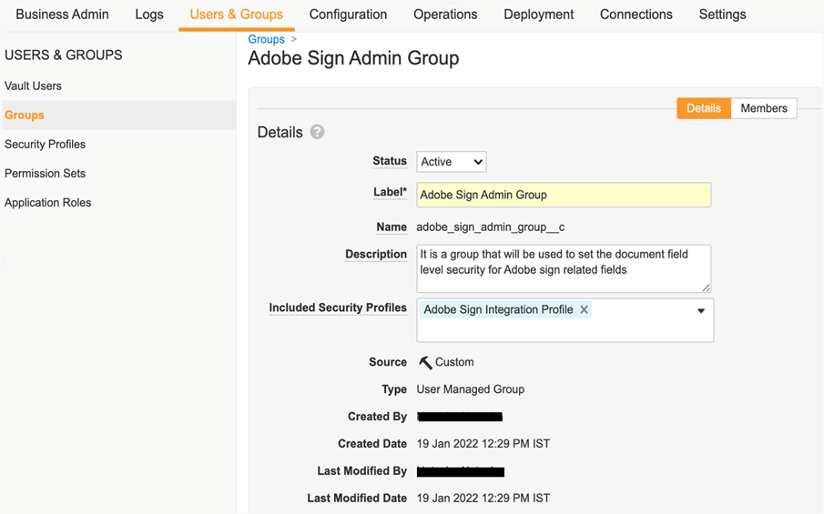
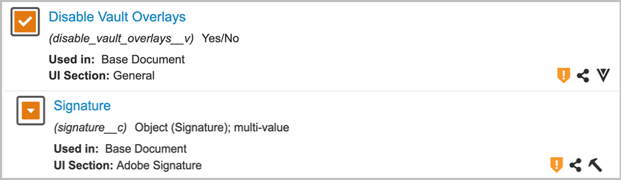
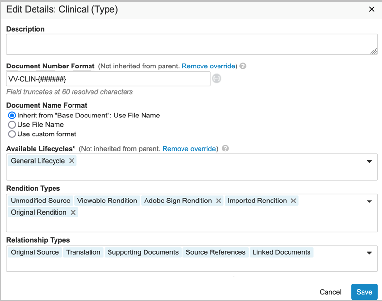
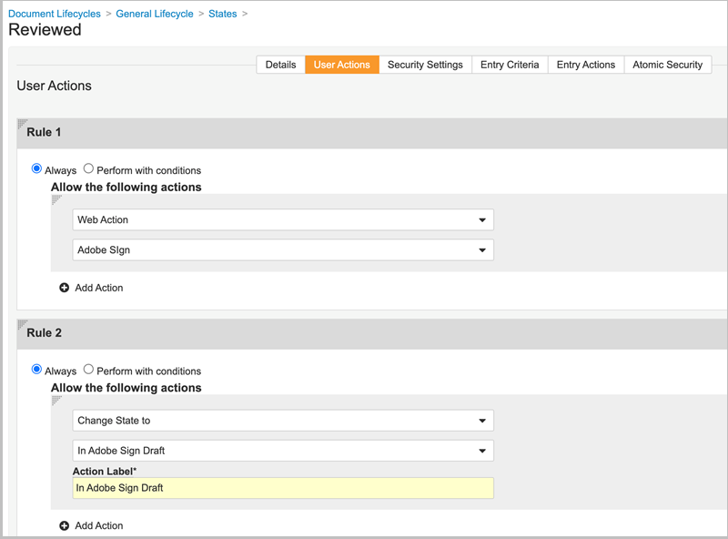
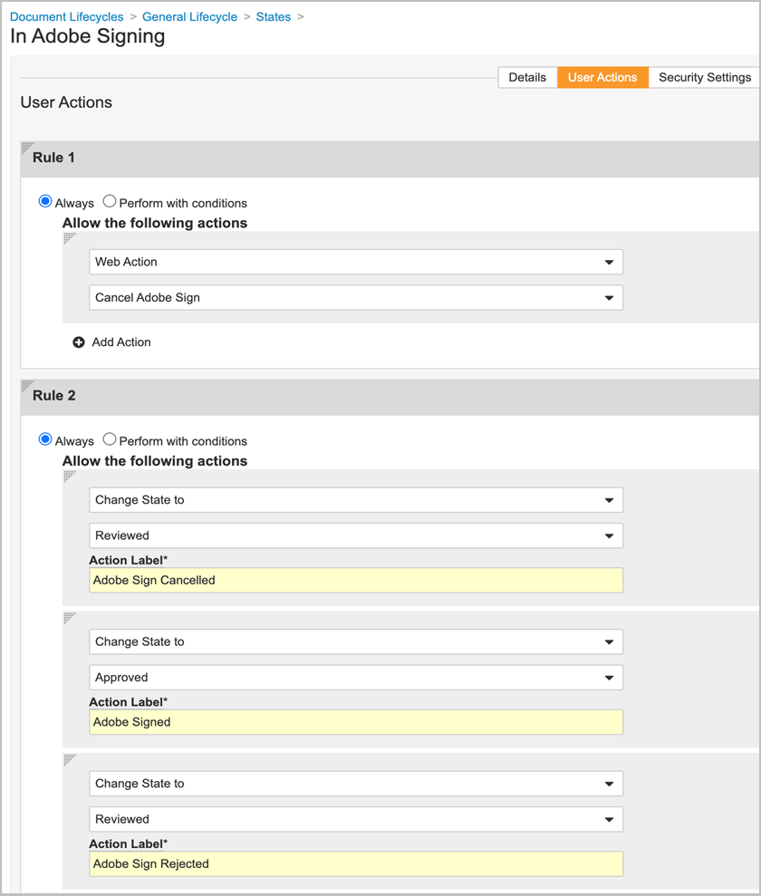
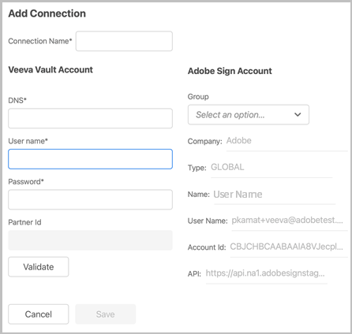
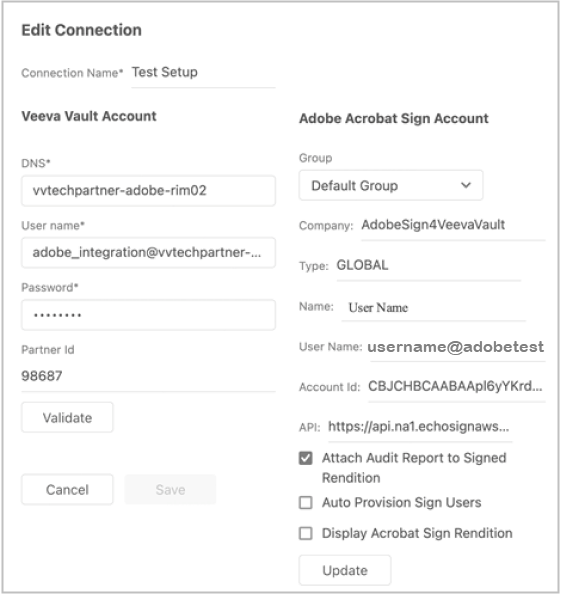
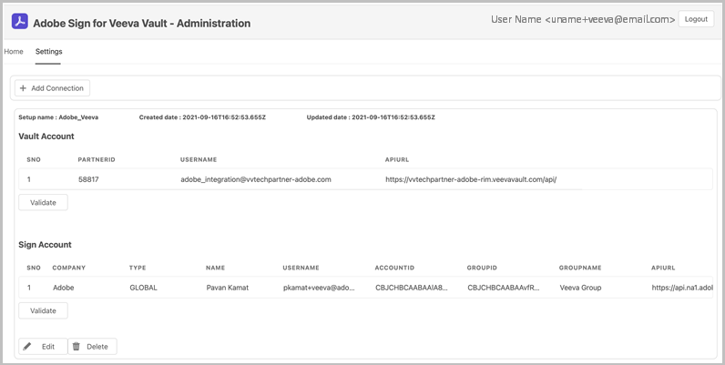

# [!DNL Veeva Vault] 설치 안내서{#veeva-installation-guide}

[**Adobe Sign 지원 문의**](https://adobe.com/go/adobesign-support-center_kr)

## 개요 {#overview}

이 문서에서는 Adobe Sign과 [!DNL Veeva Vault] 플랫폼 [!DNL Veeva Vault] 생명 과학 업계를 위해 개발된 ECM(엔터프라이즈 컨텐츠 관리) 플랫폼입니다. &quot;저장소&quot;는 규정 파일 작성, 연구 보고, 애플리케이션 부여, 일반 계약 등을 위한 일반적인 용도를 갖춘 컨텐츠 및 데이터 저장소입니다. 단일 엔터프라이즈에는 별도로 유지 관리해야 하는 여러 &#39;저장소&#39;가 있을 수 있습니다.

통합을 완성하기 위한 고급 단계는 다음과 같습니다.

* Adobe Sign에서 관리 계정을 활성화합니다(신규 고객만 해당).
* 자격 증명 모음에서 계약 수명 주기의 기록을 추적하는 개체를 만듭니다.
* 새 보안 프로필을 만듭니다.
* Adobe Sign에서 그룹을 [!DNL Veeva Vault] 통합 사용자.
* 문서 필드 및 변환을 만듭니다.
* 웹 동작을 구성하고 문서 주기를 업데이트합니다.
* 문서 유형 사용자 및 사용자 역할 설정을 생성합니다.
* 미들웨어를 사용하여 Veeva 자격 증명 모음을 Adobe Sign에 연결합니다.

>[!NOTE]
>
>Adobe Sign 관리자는 Adobe Sign 내에서 Adobe Sign 설정 단계를 수행해야 합니다.

## 구성 [!DNL Veeva Vault] {#configure-veeva}

구성하려면 [!DNL Veeva Vault] Adobe Sign과의 통합을 위해 아래 나열된 단계를 구현해야 합니다.

### 1단계. 그룹 만들기 {#create-group}

Adobe Sign 구성 방법 [!DNL Vault], 라는 새 그룹 *Adobe Sign 관리 그룹* 생성됩니다. 이 그룹은 Adobe Sign 관련 필드에 대한 문서 필드 수준 보안을 설정하는 데 사용되며 다음을 포함해야 합니다. *Adobe Sign 통합 프로필* 있습니다.

### 2단계. 패키지 배포 {#deploy-package}

[패키지 배포](https://helpx.adobe.com/content/dam/help/en/PKG-AdobeSign-Integration.zip) 단계를 따릅니다. 배포되면 패키지는 다음을 생성합니다.

* 사용자 정의 개체: Signature 객체, Signatory 객체, Signature Event 객체, Process Locker 객체
* 서명 개체 페이지 레이아웃
* 서명 이벤트 개체 페이지 레이아웃
* 서명자 개체 페이지 레이아웃
* Process Locker 개체 페이지 레이아웃
* Adobe Sign 변환 유형
* 공유 필드 서명__c , allow_adobe_sign_user_actions__c
* Adobe Sign 웹 동작
* Adobe Sign 웹 동작 취소
* Adobe Sign 관리 작업 권한 세트
* Adobe Sign 통합 프로파일 보안 프로파일
* 응용 프로그램 역할 Adobe Sign 관리자 역할
* 문서 유형 그룹 &#39;Adobe Sign 문서&#39;

#### 서명 개체 {#signature-object}

서명 개체는 계약 관련 정보를 저장하기 위해 만들어집니다. 서명 개체는 다음 특정 필드 아래의 정보가 포함된 데이터베이스입니다.

**서명 개체 필드**

| 필드 | 레이블 | 유형 | 설명 |
| --- | --- | ---| --- | 
| external_id__c | 계약 ID | 문자열(100) | Adobe Sign의 고유한 계약 ID를 보관합니다. |
| file_hash__c | 파일 해시 | 문자열(50) | Adobe Sign으로 전송된 파일의 md5 체크섬을 보관합니다. |
| name__v | 이름 | 문자열(128) | 계약 이름을 보유합니다. |
| sender__c | 발신자 | 객체(사용자) | 계약을 작성한 보관소 사용자에 대한 참조를 보유합니다. |
| signature_status__c | 서명 상태 | 문자열(75) | Adobe Sign에서 계약 상태를 유지합니다. |
| signature_type__c | 서명 유형 | 문자열(20) | Adobe Sign(WRITTEN 또는 ESIGN)에 계약의 서명 유형을 보관합니다. |
| start_date__c | 시작 날짜 | DateTime | 서명을 받기 위해 계약을 보낸 날짜 |
| cancelation_date__c | 취소 날짜 | DateTime | 계약이 취소된 날짜를 보유합니다. |
| completion_date__c | 완료 날짜 | DateTime | 계약이 완료된 날짜를 보유합니다. |
| viewable_rendition_used__c | 사용 가능한 변환 | 부울 | 볼 수 있는 변환이 서명을 위해 전송되었는지 여부를 나타내는 플래그입니다. (기본적으로 true임) |

#### 서명자 개체 {#signatory-object}

서명자 개체는 계약의 참가자와 관련된 정보를 저장하기 위해 생성됩니다. 다음과 같은 특정 필드에 대한 정보가 포함되어 있습니다.

**서명자 개체 필드**

| 필드 | 레이블 | 유형 | 설명 |
| --- | --- | ---| --- | 
| email__c | 전자 메일 | 문자열(120) | Adobe Sign의 고유한 계약 ID를 보관합니다. |
| external_id__c | 참가자 ID | 문자열(80) | Adobe Sign 고유 참가자 식별자를 보관합니다. |
| name__v | 이름 | 문자열(128) | Adobe Sign 참가자 이름을 보유합니다. |
| order__c | 순서 | 숫자 | Adobe Sign 계약 참가자의 주문 번호를 보유하고 있습니다. |
| role__c | 역할 | 문자열(30) | Adobe Sign 계약 참가자의 역할을 보유합니다. |
| signature__c | 서명 | 개체(서명) | 서명 상위 레코드에 대한 참조를 보유합니다. |
| signature_status__c | 서명 상태 | 문자열(100) | Adobe Sign 계약 참가자의 상태를 유지합니다. |
| user__c | 사용자 | 객체(사용자) | 참가자가 자격 증명 모음 사용자인 경우 서명자의 사용자 레코드에 대한 참조를 보유합니다. |

#### Signature Event 객체 {#signature-event}

서명 이벤트 개체는 계약의 이벤트 관련 정보를 저장하기 위해 만들어집니다. 다음과 같은 특정 필드에 대한 정보가 포함되어 있습니다.

| 필드 | 레이블 | 유형 | 설명 |
| --- | --- | ---| --- | 
| acting_user_email__c | 작업 중인 사용자 전자 메일 | 문자열 | 이벤트를 생성하게 한 작업을 수행한 Adobe Sign 사용자의 이메일을 보관합니다. |
| acting_user_name__c | 대리 사용자 이름 | 문자열 | 이벤트를 생성하게 한 작업을 수행한 Adobe Sign 사용자의 이름을 보관합니다. |
| description__c | 설명 | 문자열 | Adobe Sign 이벤트의 설명을 보관합니다. |
| event_date__c | 이벤트 날짜 | DateTime | Adobe Sign 이벤트의 날짜 및 시간을 보관합니다. |
| event_type__c | 이벤트 유형 | 문자열 | Adobe Sign 이벤트의 유형을 보유합니다. |
| name__v | 이름 | 문자열 | 자동 생성된 이벤트 이름 |
| participant_comment__c | 참가자 주석 | 문자열 | Adobe Sign 참가자의 주석이 있는 경우 이를 보관합니다 |
| participant_email__c | 참여자 전자 메일 | 문자열 | Adobe Sign 참가자의 전자 메일을 보관합니다. |
| participant_role__c | 참여자 역할 | 문자열 | Adobe Sign 참가자 역할을 보유합니다. |
| signature__c | 서명 | 개체(서명) | 서명 상위 레코드에 대한 참조를 보유합니다. |

#### Process Locker 개체 {#process-locker}

Adobe Sign 통합 프로세스를 잠그기 위해 Process Locker 개체가 만들어집니다. 사용자 정의 필드는 필요하지 않습니다.

### 3단계. 보안 프로필 설정 {#security-profiles}

2단계에서 패키지 배포에 성공하면 Adobe Sign 통합 프로필이 생성됩니다. Adobe Sign 통합 프로파일은 시스템 계정에 할당되며 Vault API를 호출할 때 통합에서 사용됩니다. 이 프로필은 다음에 대한 권한을 허용합니다.

* 저장소 API
* 읽기, 만들기, 편집 및 삭제: 서명, 서명자, 서명 이벤트 및 Process Locker 개체

아래 이미지와 같이 포함된 보안 프로필을 Adobe Sign 통합 프로필로 설정하여 Adobe Sign 관리 그룹(1단계에서 생성)을 업데이트해야 합니다.

### 4단계. 사용자 만들기 {#create-user}

Adobe Sign 통합의 Vault 시스템 계정 사용자는 다음을 수행해야 합니다.

* Adobe Sign 통합 프로필 보유
* 보안 프로필 보유
* 암호 만료를 해제하는 특정 보안 정책 보유
* Adobe Sign 관리 그룹의 멤버가 되어야 합니다.

이렇게 하려면 아래 단계를 따르십시오.

1. Adobe Sign 통합의 Vault 시스템 계정 사용자를 생성합니다.

   

2. Adobe Sign 관리 그룹에 사용자를 추가합니다.

   

### 5단계. 문서 유형 그룹 구성 {#create-document-type-group}

Adobe Sign 패키지를 배포하면 &#39;Adobe Sign 문서&#39;라는 문서 유형 그룹 레코드가 생성됩니다.

Adobe Sign 프로세스에 적합한 모든 문서 분류에 대해 이 문서 유형 그룹을 추가해야 합니다. 문서 형식 그룹 속성은 형식에서 하위 형식으로 상속되거나 하위 형식에서 분류 수준으로 상속되지 않으므로 Adobe Sign에 적합한 각 문서의 분류에 대해 설정해야 합니다.

**참고:** 사용자 역할 설정 개체에 문서 유형 그룹 개체를 참조하는 필드가 없으면 필드를 추가해야 합니다. 이렇게 하려면 **[!UICONTROL 개체]** > **[!UICONTROL 사용자 역할 설정]** > **[!UICONTROL 필드]** 아래 이미지와 같이 필요한 단계를 완료합니다.

### 6단계. 사용자 역할 설정 만들기 {#create-user-role-setup}

주기가 적절하게 구성되면, 시스템은 Adobe Sign 프로세스에 적합한 모든 문서에 대해 DAC에 Adobe Sign 관리 사용자가 추가되었는지 확인해야 합니다. 이는 다음을 지정하는 적절한 사용자 역할 설정 레코드를 생성하여 수행됩니다.

* 문서 유형 그룹을 Adobe Sign 문서로
* Adobe Sign 관리자 역할로서의 응용 프로그램 역할
* 통합 사용자

### 7단계. 문서 필드 설정 {#create-fields}

패키지 배포는 통합 구축을 위해 필요한 다음과 같은 두 개의 새로운 공유 문서 필드를 생성합니다.

* 서명(signature__c)
* Adobe Sign 사용자 작업 허용(allow_adobe_sign_user_actions__c)

문서 필드를 설정하려면 다음을 수행하십시오.

1. 구성 탭으로 이동하여 **[!UICONTROL 문서 필드]** > **[!UICONTROL 공유 필드]**.
1. [섹션 표시] 필드에서 **[!UICONTROL 표시 섹션 만들기]** 및 할당 **[!UICONTROL Adobe 서명]** 섹션 레이블로 사용합니다.

   

1. 두 개의 공유 문서 필드(signature__c 및 allow_adobe_sign_user_actions__c)의 경우 **[!UICONTROL Adobe 서명]** 섹션 레이블로 사용합니다.
1. Adobe 서명에 적합한 모든 문서 유형에 세 개의 공유 필드를 추가합니다. 이렇게 하려면 기본 문서 페이지에서 **[!UICONTROL 추가]** > **[!UICONTROL 기존 공유 필드]** 을 클릭합니다.

   

   

   

1. 두 필드 모두 Adobe Sign 관리 그룹의 구성원만 값을 업데이트할 수 있는 특정 보안이 있어야 합니다.

   

저장소 오버레이 비활성화(disable_vault_overlays__v)는 기존 공유 필드입니다. 선택적으로, 필드에는 Adobe Sign 관리 그룹의 구성원만 해당 값을 업데이트할 수 있는 특정 보안이 있을 수 있습니다.

### 8단계. 문서 변환 선언 {#declare-renditions}

새 변환 유형 *Adobe Sign 변환 (adobe_sign_rendition__c)* 저장소 통합에서 서명된 PDF 문서를 Adobe Sign에 업로드하는 데 사용됩니다. Adobe 서명에 적합한 각 문서 유형에 대해 Adobe Sign 변환을 선언해야 합니다.

### 9단계. 웹 동작 업데이트 {#web-actions}

Adobe Sign 및 Vault 통합에서는 다음 두 가지 웹 작업을 작성하고 구성해야 합니다.

* **Adobe Sign 만들기**: Adobe Sign 계약을 생성하거나 표시합니다.

   유형: 문서 대상: 자격 증명 모음 내 표시: 사후 메시지 URL을 통해 사후 세션 자격 증명 사용: <https://api.na1.adobesign.com/api/gateway/veevavaultintsvc/partner/agreement?docId=${Document.id}&majVer=${Document.major_version_number__v}&minVer=${Document.minor_version_number__v}&vaultid=${Vault.id}&useWaitPage=true>

   

* **Adobe Sign 취소**: Adobe Sign에서 기존 계약을 취소하고 문서 상태를 초기 상태로 되돌립니다.

   유형: 문서 대상: 자격 증명 모음 내 표시: 사후 메시지 URL을 통해 사후 세션 자격 증명 사용: : <https://api.na1.adobesign.com/api/gateway/veevavaultintsvc/partner/agreement/cancel?docId=${Document.id}&majVer=${Document.major_version_number__v}&minVer=${Document.minor_version_number__v}&vaultid=${Vault.id}&useWaitPage=true>

   

### 10단계. 문서 생명주기 업데이트 {#document-lifecycle}

Adobe 서명에 적합한 각 문서 유형에 대해 새 주기 역할과 상태를 추가하여 해당 문서 주기를 업데이트해야 합니다.

Adobe Sign 계약 주기에는 다음과 같은 상태가 있습니다.

* 초안
* AUTHORING 또는 DOCUMENTS_NOT_YET_PROCESSED
* OUT_FOR_SIGNATURE 또는 OUT_FOR_APPROVAL
* 서명됨 또는 승인됨
* 취소됨
* 만료됨

문서 생명주기를 업데이트하려면 아래 단계를 따르십시오.

1. 주기 역할을 추가합니다. Adobe Sign 관리자 응용 프로그램 역할은 아래와 같이 Adobe 서명이 가능한 문서에서 사용하는 모든 주기에 추가되어야 합니다.

   

   관리자 역할은 다음 옵션을 사용하여 만들어야 합니다.

   * 동적 액세스 제어를 사용합니다.
   * 아래 이미지와 같이 문서 유형 그룹만 포함하는 문서 공유 규칙입니다.

   

2. 주기 상태를 작성합니다. 이렇게 하려면 **[!UICONTROL 설정]** > **[!UICONTROL 구성]** > **[!UICONTROL 문서 생명주기]** > **[!UICONTROL 일반 주기]** > **[!UICONTROL 상태]** > **[!UICONTROL 만들기]**. 다음으로 다음 상태를 만듭니다.

   * Adobe Sign Draft에서

   

   * Adobe Sign 작성에서

   

   * Adobe 서명 중

   

3. 아래 나열된 상태에 사용자 작업을 추가합니다.

   보관소 문서가 Adobe Sign으로 전송될 때 그 상태는 계약서의 상태와 일치해야 합니다. 이렇게 하려면 Adobe 서명이 가능한 문서에 사용되는 모든 주기에서 다음 상태를 추가합니다.

   * **Adobe 서명 전** (검토됨): Adobe Sign으로 문서를 보낼 수 있는 상태에 대한 자리 표시자 이름입니다. 문서 유형에 따라 [초안] 상태 또는 [검토됨]이 될 수 있습니다. 문서 상태 레이블은 고객의 요구 사항에 따라 맞춤화할 수 있습니다. Adobe 이전 서명 상태는 다음 두 가지 사용자 작업을 정의해야 합니다.

      * 문서 상태를 다음으로 변경하는 작업 *Adobe Sign Draft에서* 시/도 이 사용자 작업의 이름은 모든 주기의 모든 문서 유형에 대해 동일해야 합니다. 필요한 경우 이 작업에 대한 기준을 &quot;Adobe Sign 사용자 작업 허용이 Yes&quot;로 설정할 수 있습니다.
      * 웹 동작을 &#39;Adobe Sign&#39;라고 부르는 동작입니다. 이 상태에는 Adobe Sign 관리자 역할이 다음을 수행할 수 있는 보안이 있어야 합니다. 문서 보기, 컨텐츠 보기, 필드 편집, 관계 편집, 소스 다운로드, 표시 가능한 변환 관리 및 상태 변경 등의 작업을 수행할 수 있습니다.

      

   * **Adobe Sign Draft에서**: 이는 문서가 이미 Adobe Sign에 업로드되었고 계약이 초안 상태임을 나타내는 상태의 자리 표시자 이름입니다. 필수 상태입니다. 이 상태는 다음 다섯 가지 사용자 작업을 정의해야 합니다.

      * 문서 상태를 다음으로 변경하는 작업 *Adobe Sign 작성에서* 시/도 이 사용자 작업의 이름은 모든 주기의 모든 문서 유형에 대해 동일해야 합니다. 필요한 경우 이 작업에 대한 기준을 &quot;Adobe Sign 사용자 작업 허용이 Yes&quot;로 설정할 수 있습니다.
      * 문서 상태를 다음으로 변경하는 작업 *Adobe 서명 상태*. 이 사용자 작업의 이름은 모든 주기의 모든 문서 유형에 대해 동일해야 합니다. 필요한 경우 이 작업에 대한 기준을 &quot;Adobe Sign 사용자 작업 허용이 Yes&quot;로 설정할 수 있습니다.
      * 문서 상태를 다음으로 변경하는 작업 *Adobe Sign 취소됨* 시/도 이 사용자 작업의 이름은 모든 주기의 모든 문서 유형에 대해 동일해야 합니다. 필요한 경우 이 작업에 대한 기준을 &quot;Adobe Sign 사용자 작업 허용이 Yes&quot;로 설정할 수 있습니다.
      * 웹 동작 &#39;Adobe Sign&#39; 을 호출하는 동작입니다.
      * 웹 작업 &#39;Adobe Sign 취소&#39;를 호출하는 작업입니다. 이 상태에는 Adobe Sign 관리자 역할로 다음을 수행할 수 있는 보안이 있어야 합니다. 문서 보기, 컨텐츠 보기, 필드 편집, 관계 편집, 소스 다운로드, 표시 가능한 변환 관리 및 상태 변경 등의 작업을 수행할 수 있습니다.

      

   * **Adobe Sign 작성에서**: 문서가 이미 Adobe Sign에 업로드되어 있고 해당 계약이 AUTHORING 또는 DOCUMENTS_NOT_YET_PROCESSED 상태임을 나타내는 상태에 대한 자리 표시자 이름입니다. 필수 상태입니다. 이 상태에는 다음 네 가지 사용자 작업이 정의되어 있어야 합니다.

      * 문서의 상태를 Adobe Sign 취소됨 상태로 변경하는 작업입니다. 이 사용자 작업의 이름은 수명 주기에 관계없이 모든 문서 유형에 대해 동일해야 합니다. 필요한 경우 이 작업에 대한 기준을 &quot;Adobe Sign 사용자 작업 허용이 Yes&quot;로 설정할 수 있습니다.
      * 문서의 상태를 Adobe 서명 중 상태로 변경하는 작업입니다. 이 사용자 작업의 이름은 수명 주기에 관계없이 모든 문서 유형에 대해 동일해야 합니다. 필요한 경우 이 작업에 대한 기준을 &quot;Adobe Sign 사용자 작업 허용이 Yes&quot;로 설정할 수 있습니다.
      * 웹 동작을 &#39;Adobe Sign&#39;라고 하는 동작
      * 웹 작업 &#39;Adobe Sign 취소&#39;를 호출하는 작업입니다. 이 상태에는 Adobe Sign 관리자 역할로 다음을 수행할 수 있는 보안이 있어야 합니다. 문서 보기, 컨텐츠 보기, 필드 편집, 관계 편집, 소스 다운로드, 표시 가능한 변환 관리 및 상태 변경 등의 작업을 수행할 수 있습니다.

      

   * **Adobe 서명 중**: 문서가 Adobe Sign에 업로드되고 해당 계약서가 이미 참가자에게 전송되었음을 나타내는 상태의 자리 표시자 이름입니다(OUT_FOR_SIGNATURE 또는 OUT_FOR_APPROVAL 상태). 필수 상태입니다. 이 상태에는 다음 다섯 가지 사용자 작업이 정의되어 있어야 합니다.

      * 문서의 상태를 Adobe Sign 취소됨 상태로 변경하는 작업입니다. 이 작업의 대상 상태는 고객의 요구 사항이 무엇이든지 될 수 있으며, 서로 다른 유형에 따라 다를 수 있습니다. 이 사용자 작업의 이름은 수명 주기에 관계없이 모든 문서 유형에 대해 동일해야 합니다. 필요한 경우 이 작업에 대한 기준을 &quot;Adobe Sign 사용자 작업 허용이 Yes&quot;로 설정할 수 있습니다.
      * 문서의 상태를 Adobe Sign 거부됨 상태로 변경하는 작업입니다. 이 작업의 대상 상태는 고객의 요구 사항이 무엇이든지 될 수 있으며, 서로 다른 유형에 따라 다를 수 있습니다. 이 사용자 작업의 이름은 수명 주기에 관계없이 모든 문서 유형에 대해 동일해야 합니다. 필요한 경우 이 작업에 대한 기준을 &quot;Adobe Sign 사용자 작업 허용이 Yes&quot;로 설정할 수 있습니다.
      * 문서의 상태를 Adobe 서명됨 상태로 변경하는 작업입니다. 이 작업의 대상 상태는 고객의 요구 사항이 무엇이든지 될 수 있으며, 서로 다른 유형에 따라 다를 수 있습니다. 그러나 이 사용자 작업의 이름은 수명 주기에 관계없이 모든 문서 유형에 대해 동일해야 합니다. 필요한 경우 이 작업에 대한 기준을 &quot;Adobe Sign 사용자 작업 허용이 Yes&quot;로 설정할 수 있습니다.
      * 웹 동작을 호출하는 동작 *Adobe Sign*.
      * 웹 동작을 호출하는 동작 *Adobe Sign 취소*. 이 상태에는 Adobe Sign 관리자 역할로 다음을 수행할 수 있는 보안이 있어야 합니다. 문서 보기, 컨텐츠 보기, 필드 편집, 관계 편집, 소스 다운로드, 표시 가능한 변환 관리 및 상태 변경 등의 작업을 수행할 수 있습니다.

      

      * **서명된 Adobe(승인됨)**: 문서가 Adobe Sign에 업로드되고 계약이 완료되었음을 나타내는 상태(서명됨 또는 승인됨 상태)의 자리 표시자 이름입니다. 필수 상태이며 승인됨과 같은 기존 주기 상태일 수 있습니다.
이 상태에는 사용자 작업이 필요하지 않습니다. Adobe Sign 관리자 역할로 다음을 수행할 수 있는 보안이 있어야 합니다. 문서를 보고, 콘텐츠를 보고, 필드를 편집합니다.

   다음 다이어그램은 &#39;Adobe 이전 서명&#39; 상태가 초안인 Adobe Sign 계약과 보관 문서 상태 간의 매핑을 보여 줍니다.

   

### 11단계. Lifecycle Stage 그룹의 일반 주기에 Adobe Sign 스테이지 추가

### 12단계. 주기 상태의 사용자 역할에 대한 권한 설정

아래 이미지와 같이 주기 상태에서 각 사용자 역할에 대해 적절한 권한을 설정해야 합니다.

### 13단계. 문서 상태 및 사용자 역할을 기반으로 원자성 보안 설정

### 14단계. Adobe Sign 취소에 대한 문서 메시지 만들기

## Connect [!DNL Veeva Vault] 미들웨어를 사용하여 Adobe Sign으로 {#connect-middleware}

다음에 대한 설정을 완료한 후 [!DNL Veeva Vault] 및 Adobe Sign 관리 계정은 관리자가 미들웨어를 사용하여 두 계정 간에 연결을 만들어야 합니다. 추가 [!DNL Veeva Vault] 및 Adobe Sign 계정 연결은 Adobe Sign Identity에 의해 시작된 다음 저장하는 데 사용됩니다.[!DNL Veeva Vault]있습니다.
시스템 보안 및 안정성을 위해 관리자는 전용 [!DNL Veeva Vault] 시스템/서비스/유틸리티 계정(예: `adobe.for.veeva@xyz.com`에 대한 개인 사용자 계정 대신 `bob.smith@xyz.com`.

Adobe Sign 계정 관리자는 아래 단계에 따라 연결해야 합니다 [!DNL Veeva Vault] 미들웨어를 사용하여 Adobe Sign으로

1. 다음으로 이동 [Adobe Sign [!DNL Veeva Vault] 홈 페이지](https://static.adobesigncdn.com/veevavaultintsvc/index.html).
1. 선택 **[!UICONTROL 로그인]** 을 클릭합니다.

   

1. 열리는 Adobe Sign 로그인 페이지에서 계정 관리자의 전자 메일과 암호를 입력한 다음 을 선택합니다. **[!UICONTROL 로그인]**.

   

   로그인에 성공하면 페이지에 연결된 전자 메일 ID와 설정 탭이 아래와 같이 표시됩니다.

   

1. 다음을 선택합니다. **[!UICONTROL 설정]** 탭합니다.

   [설정] 페이지에 사용 가능한 연결이 표시되고 *사용 가능한 연결이 없습니다.* 아래와 같이 첫 번째 연결 설정의 경우

   

1. 선택 **[!UICONTROL 연결 추가]** 을 눌러 새 연결을 추가합니다.

1. 열린 연결 추가 대화 상자에서 다음을 포함하여 필요한 세부 정보를 입력합니다. [!DNL Veeva Vault] 자격 증명

   Adobe Sign 자격 증명은 초기 Adobe Sign 로그인에서 자동으로 채워집니다.

   

1. 선택 **[!UICONTROL 유효성 검사]** 을 눌러 계정 세부 정보를 확인합니다.

   유효성 검사가 완료되면 아래 그림과 같이 &#39;사용자가 유효성 검사를 완료했습니다&#39; 알림이 표시됩니다.

   

1. 특정 Adobe Sign 그룹으로 사용을 제한하려면 **[!UICONTROL 그룹]** 드롭다운 목록에서 사용 가능한 그룹 중 하나를 선택합니다.

   

1. 서명된 변환에 감사 보고서를 첨부하려면 확인란을 선택합니다 **[!UICONTROL 서명된 변환에 감사 보고서 첨부]**.

   

1. Adobe Sign에서 사용자 자동 프로비저닝을 허용하려면 확인란을 선택합니다 **[!UICONTROL Sign 사용자 자동 프로비저닝]**.

   **참고:** 새 Adobe Sign 사용자의 자동 프로비저닝은 Adobe Sign의 Adobe Sign 계정 수준에서 사용하도록 설정한 경우에만 작동합니다. **[!UICONTROL Sign 사용자 자동 프로비저닝]** 의 경우[!DNL Veeva Vault]Adobe Sign 계정 관리자가 아래 그림과 같이 Adobe Sign 통합

   

1. 선택 **[!UICONTROL 저장]** 새 연결을 저장합니다.

   새 연결은 설정 탭 아래에 나타나며 [!DNL Veeva Vault] 및 Adobe Sign

   

