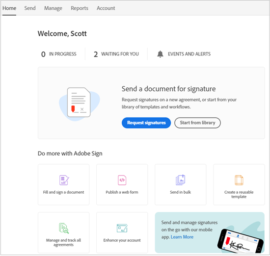

# [!DNL Workday] 설치 안내서{#workday-installation-guide}

[**Adobe Sign 지원 문의**](https://adobe.com/go/adobesign-support-center_kr)

## 개요 {#overview}

이 문서에서는 Adobe Sign을 [!DNL Workday] 테넌트입니다. Adobe Sign 사용 방법 [!DNL Workday]를 만들고 수정하는 방법을 알고 있어야 합니다 [!DNL Workday] 다음과 같은 항목:

* 비즈니스 프로세스 프레임워크
* 테넌트 설정 및 구성
* 보고 및 [!DNL Workday] studio integration

통합을 완성하기 위한 고급 단계는 다음과 같습니다.

* Adobe Sign에서 관리 계정 활성화 (신규 고객만 해당)
* Adobe Sign에서 그룹을 [!DNL Workday] 통합 사용자
* 다음의 OAuth 관계 설정 [!DNL Workday] 및 Adobe Sign

## Adobe Sign 계정 활성화 {#activating-your-adobe-sign-account}

계정이 설정된 기존 고객은 [Adobe Sign 구성 [!DNL Workday]](#config) 항목을 참조하십시오.

Adobe Sign을 처음 사용하며 기존 로그인이 없는 고객의 경우 Adobe 온보딩 전문가가 계정(Adobe Sign)을 [!DNL Workday]. 완료되면 아래와 같이 확인 이메일을 수신하게 됩니다.

전자 메일의 지침에 따라 계정을 초기화하고 Adobe Sign에 액세스해야 합니다. [!UICONTROL 홈] 페이지를 엽니다.

## Adobe Sign 구성 [!DNL Workday] {#config}

Adobe Sign 구성 방법 [!DNL Workday]Adobe Sign 시스템에서 다음 두 개의 전용 객체를 생성해야 합니다.

* **A [!DNL Workday] 그룹**: [!DNL Workday] 통합 기능을 사용하려면 Adobe Sign 계정 내에 전용 &quot;그룹&quot;이 있어야 합니다. Adobe Sign 그룹은 [!DNL Workday] Adobe Sign 사용. Salesforce.com 또는 Arriba와 같은 다른 잠재적 사용은 영향을 받지 않습니다. 전자 메일 알림이 [!DNL Workday] 그룹화하여 [!DNL Workday] 사용자는 자신의 [!DNL Workday] 받은 편지함입니다.

* **통합 키를 보유하는 인증 사용자**: A [!DNL Workday] 그룹에는 통합 키의 권한 있는 소유자인 그룹 수준 관리자가 하나만 있어야 합니다. 관리자는 다음과 같은 기능 이메일 주소를 사용하는 것이 좋습니다. `HR@MyDomain.com` 개인 이메일 대신, 사용자가 나중에 비활성화되어 결과적으로 통합이 비활성화될 위험을 줄입니다.

### Adobe Sign에서 사용자 및 그룹 만들기 {#create-a-user-and-group-in-adobe-sign}

Adobe Sign에서 사용자를 만들려면:

1. 계정 관리자로 Adobe Sign에 로그인합니다..
1. 다음으로 이동 **[!UICONTROL 계정]** > **[!UICONTROL 사용자]**.
1. 오른쪽 상단의  을 눌러 새 사용자를 생성합니다.

   

1. 열리는 대화 상자에서 새 사용자 세부 정보를 입력합니다.

   * 액세스할 수 있는 기능 이메일을 입력합니다.
   * 적절한 이름 및 성 값을 입력합니다.
   * 선택 **[!UICONTROL 이 사용자의 새 그룹 만들기]** 사용자 그룹에서
   * 다음을 제공합니다. **[!UICONTROL 새 그룹 이름]** 와 같은 직관적인 이름으로 *[!DNL Workday]*.

   

1. **[!UICONTROL 저장]**&#x200B;을 클릭합니다.

   다시 [!UICONTROL 사용자] 새 사용자를 나열하는 페이지 **[!UICONTROL 생성됨]** 상태.

   

&quot;생성됨&quot; 상태의 사용자 전자 메일 주소를 확인하려면 다음을 수행하십시오.

1. 새 사용자의 전자 메일에 로그인합니다.
2. &quot;Adobe Sign 시작&quot; 이메일을 찾습니다.
3. 메시지가 표시된 위치를 클릭합니다. **[!UICONTROL 암호를 설정하려면 여기를 클릭하십시오.]**.
4. 암호 설정.

전자 메일 주소를 확인하면 사용자의 상태가 [!UICONTROL 생성됨] 에 [!UICONTROL 활성].

### 인증 사용자 정의 {#define-the-authenticating-user}

새 사용자를 [!DNL Workday] 그룹:

1. 다음 위치로 이동합니다. [!UICONTROL 사용자] 페이지(아직 없는 경우)
2. 사용자 [!DNL Workday] 그룹입니다.

   그러면 [!UICONTROL 편집] 페이지를 참조하십시오.

3. 확인 **[!UICONTROL 그룹 관리자]**.
4. **[!UICONTROL 저장]**&#x200B;을 클릭합니다.

## 구성 [!DNL Workday] 임차인 {#configure-workday}

다음 중 하나를 사용하여 [!DNL Workday] 테넌트와 Adobe Sign, 서비스 간에 신뢰 관계를 설정해야 합니다. 완료되면 Adobe Sign을 통해 서명 프로세스를 활성화하는 문서 검토 단계를 추가할 수 있습니다.

>[!NOTE]
>
>Adobe Sign은 전체에 걸쳐 Adobe Document Cloud 로 표시됩니다. [!DNL Workday] 있습니다.

신뢰할 수 있는 관계를 설정하려면 다음을 수행하십시오.

1. 로그인 [!DNL Workday] 계정 관리자로 로그인합니다.
1. 열기 **[!UICONTROL 테넌트 설정 편집 - 비즈니스 프로세스]** 페이지를 엽니다.
1. [!UICONTROL eSignature 구성] 섹션을 찾습니다.

   

1. 클릭 **[!UICONTROL Adobe으로 인증]**.

   그러면 OAuth2.0 인증 순서가 시작됩니다.

1. 메시지가 표시되면 앞서 만든 Adobe Sign 그룹 관리자의 자격 증명을 입력합니다.
1. Adobe Sign에 대한 액세스를 승인합니다.

>[!NOTE]
>
>계속하기 전에 다른 Adobe Sign 인스턴스에서 완전히 로그아웃했는지 확인합니다.

연결되면 Adobe 구성 사용 확인란이 설정되어 있으며 다음으로 Adobe Sign 사용을 시작할 수 있습니다. [!DNL Workday].

### 문서 검토 단계 구성 {#configure-review}

문서 검토 단계의 문서는 다음 중 하나가 될 수 있습니다.

* 정적 문서
* 동일한 업무 프로세스 내의 문서 생성 단계를 통해 생성된 문서
* 다음을 사용하여 만든 서식 있는 보고서 [!DNL Workday] 보고서 디자이너

다음 문서를 [Adobe 텍스트 태그](https://adobe.com/go/adobesign_text_tag_guide_kr) Adobe 서명 특정 구성 요소의 모양 및 위치를 제어합니다. 비즈니스 프로세스 정의 내에 문서 원본이 지정되어야 합니다. 비즈니스 프로세스가 실행되는 동안 임시 문서를 업로드할 수 없습니다.

문서 검토 단계에서 Adobe Sign을 사용하는 것 이외에 고유한 것은 서명자 그룹을 일련화하는 기능입니다. 이 기능 덕분에 차례로 서명하는 역할 기반의 그룹을 지정할 수 있습니다. Adobe Sign은 병렬 서명 그룹을 지원하지 않습니다.

문서 검토 단계 구성에 대한 자세한 내용은 [빠른 시작 안내서](https://adobe.com//go/adobesign_workday_quick_start){target=&quot;_blank&quot;}.

## 지원 {#support}

### [!DNL Workday] 지원 {#workday-support}

[!DNL Workday] 통합 소유자이며 통합 범위, 기능 요청 또는 통합의 일상적인 기능에 대한 질문에 대한 첫 번째 연락처여야 합니다.

다음을 참조할 수 있습니다 [!DNL Workday] 통합 문제 해결 및 문서 생성 방법에 대한 커뮤니티 문서:

* [전자 서명 통합 문제 해결](https://doc.workday.com/#/reader/3DMnG~27o049IYFWETFtTQ/zhA~hYllD3Hv1wu0CvHH_g)
* [문서 검토 단계](https://doc.workday.com/#/reader/3DMnG~27o049IYFWETFtTQ/TboWWKQemecNipWgxLAjqg)
* [동적 문서 생성](https://community.workday.com/saml/login?destination=/articles/176443)
* [구인 문서 생성 팁](https://community.workday.com/node/183242)

### Adobe Sign 지원 {#adobe-sign-support}

Adobe Sign은 통합 파트너로서, 통합 과정에서 서명을 받지 못하거나 대기 중인 서명의 알림에 실패하는 경우에 문의해야 합니다.

Adobe Sign 고객은 담당 고객 성공 관리자(CSM)에게 지원을 요청해야 합니다. 또는 Adobe 기술 지원(전화: 1-866-318-4100)에 전화하여 제품 목록이 나오면 4번에 이어 2번(전화 안내에 따라)을 누르면 됩니다.

* [문서에 Adobe 텍스트 태그 추가하기](https://adobe.com/go/adobesign_text_tag_guide)
* [문서 구성 및 예제 검토](https://www.adobe.com//go/adobesign_workday_quick_start)

## 일반적인 질문 {#faq}

### 상태가 내부에서 업데이트되지 않는 이유는 무엇입니까? [!DNL Workday] 문서가 완전히 서명된 경우에도 {#why-is-the-status-not-being-updated-within-workday-even-the-document-is-fully-signed}

의 문서 상태 [!DNL Workday] 후보자가 &#39;[!UICONTROL 제출]&#39; 단추를 클릭하여 Adobe Sign에서 서명합니다.

에 따라 [!DNL Workday] 작업 전자 서명 서명 서명 상태 확인: 사용자는 프로세스를 시작하기 위해 연결된 받은 편지함 작업을 제출할 수 있습니다.

에 따라 [!DNL Workday] 개발: 원래 서명은 사용자가 문서에 서명한 후 받은 편지함 작업을 제출하는 경우에만 프로세스를 완료합니다. 서명 후 iframe이 닫히고 사용자는 동일한 작업으로 리디렉션됩니다. 여기서 사용자는 [!UICONTROL 제출] 버튼을 클릭하여 프로세스를 완료합니다.
